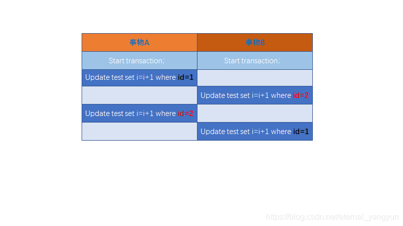

### 1.全局锁

FTWRL

```sql
flush table with read lock;
unlock tables;
```

### 2. 全局锁的作用（全库逻辑备份）

上面看到了全局锁会让数据库只处于可读的状态，这种状态会使数据库处于一个多么低效率的状态，那么为什么还需要它呢？

**低效率的原因：**

- 如果你在**主库上**备份，那么在备份期间都不能执行更新，业务基本上就得停摆；
- 如果你在**从库上**备份，那么备份期间从库不能执行主库同步过来的**binlog**，会导致主从延迟；

因为**在以前**，全局锁的主要作用就是：**做全库逻辑备份；**
即在备份的时候，加上全局锁，让表只处于可读状态，处于这种

那么为什么这么做呢？即为什么需要在备份的时候加全局锁呢，这里用**反证法来证明：**

> **案例：**假如一个商城里有两张表，一张用户所购商品表，一张是用户余额表，假如在备份商品表刚完成还没开始备份用户余额表的时候，一位用户购买了某个产品，此时它的余额扣除成功，然后备份了用户余额表，**这时造成的现象就是：备份的商品表没有用户买的那个商品，但备份的余额表却扣除了钱；**
>
> **假如是备份完余额表，用户下单，再备份商品表的话，结果就是：用户的余额没扣，却多了商品；**

上面的案例说明了，在做全库逻辑备份的时候，如果不加锁，**会造成备份得到的库里面的表不是一个逻辑时间点** ，这个视图是逻辑不一致的；那么提到这，**对于视图一致性，事物的可重复读这个隔离性不就能够实现吗**；所以**官方自带逻辑备份工具是mysqldump。当mysqldump使用参数-single-transaction的时候，导数据之前就会启动一个事物，来确保拿到一致性视图。而由于MVCC的支持，这个过程中数据是可以正常更新的；**

**那么，有了mysqldump这个功能，为什么还需要FTWRL？**（⭐）
因为mysqldump是基于事物的，而有些引擎不支持事物，比如MyISAM，这种引擎在做全库逻辑备份的时候就只能使用全局锁了；


**对于全库只读，还有一种方式可以实现：**

```
set global readonly = true
```

那么到底使用set的方式还是使用FTWRL的方式来进行全库逻辑备份呢？**这里有两个原因推荐使用FTWRL：**

- 1.在有些系统里，readonly的值会被用来做其他逻辑，比如用来判断一个库是主库还是备库，因此修改global变量的影响比较大，不建议使用；

- 2.两者在

  异常处理机制上有差异：

  - 执行FTWRL命令之后由于客户端的发生异常断开，那么MySQL会自动释放这个全局锁，整个库可以回到正常更新的状态；
  - 执行set global这个方式的话，如果客户端发生异常，则数据库还是一直会保持只读状态，这样会导致整个库长时间处于不可写状态，风险较高；

## 2. 表级锁

MySQL里面表级别的锁分两种：

- 表锁
- 元数据锁（mete data lock，MDL）

**加锁命令：** lock tables 表名 read/write

```
mysql> lock table test read;
Query OK, 0 rows affected (0.00 sec)
```

释放锁的命令：unlock tables；

#### 1. 特点

- 当还没有出现更细粒度的锁时，表锁是常用的处理并发问题的方式，**而对于InnoDB这种支持行锁的引擎，一般不适用表锁，因为表锁的影响效率还是很大；**
- 对某个表加表锁锁，不仅影响其他线程对该表的对应操作，也会影响当前线程对这张表的操作，例如：


```sql
mysql> lock table test read;
Query OK, 0 rows affected (0.00 sec)

mysql> insert into test(name,adress) values('ygz','zhongxian');
ERROR 1099 (HY000): Table 'test' was locked with a READ lock and can't be updated
```


- 上面表示了对该表加**读锁**后，自己也不能对其进行修改；**自己和其他线程只能读取该表；**
- **当对某个表执加上写锁后（lock table t1 write），该线程可以对这个表进行读写，其他线程对该表的读和写都受到阻塞；** （⭐）
  例子：启动一个命令行（线程）连接数据库，对test表进行加上写锁，然后在该线程中执行读和写：

```
mysql> insert into test(name,adress) values('zsf','zhongxian');
Query OK, 1 row affected (0.64 sec)

mysql> select * from test;
+----+------+-----------+
| id | name | adress    |
+----+------+-----------+
|  1 | yy   | ChongQing |
|  2 | lch  | XiAn      |
|  3 | yyg  | zhongxian |
|  4 | ygz  | zhongxian |
|  5 | zsf  | zhongxian |
+----+------+-----------+
5 rows in set (0.00 sec)
```

然后启动另外一个线程（重新打开一个cmd连接该数据库），然后执行查询test表，如下，**回车后将会阻塞于此，处于无结果状态（ctrol+c可以撤销）：**

```
mysql> select * from test;
```

当在第一个线程中执行unlock tables后（即释放这个写锁），第二个线程的查询马上就有了结果；
同样，在第二个线程中对该表的更新也是一样的效果；

### 2. MDL元数据锁（metadata lock）

#### 1. 特点

- **==MDL是在MySQL5.5中引入的，MDL不需要显示的使用==**，在访问一个表的时候会**自动加上**，它的作用是保证读写的正确性；

- 当对一个表做增删查改的时候，加MDL读锁，当对

  表结构做更改

  操作的时候，加MDL写锁；

   

  - **读锁之间不互斥**，所以可以多个线程同时对一张表增删查改；
  - **读写锁之间，写锁之间是互斥的**，如果有多个线程要同时给一个表加字段，其中一个要等待另外一个执行完成才能开始执行；

- **事物中的MDL锁，在语句执行时开始申请，，但是语句结束后并不会马上释放，而是等到这个事物提交后才释放；** （⭐）

**MDL锁作用：（例子）**

==确保DML的线程安全不会被DDL破坏==

**假如一个线程正在遍历一个表，在此期间另一个线程对这个表的结构做了变更，比如加了个字段，那么遍历查询的线程拿到的结果跟表结构对不上，这肯定是不行的；**


### 3. MDL锁的坑————给一个小表加字段

#### 1. 问题描述

这里将讲述关于给一个小表加字段的注意事项，曾经有人因为这导致了整个库挂掉；

如上图，事物A先开启，这时会对表t加一个**MDL读锁**，由于事物B需要的也是MDL读锁，因此可以正常执行；
但此时事物C需要更改表的结构，则需要获取MDL写锁，但此时事物A的读锁还没有释放，所以事物C就会被阻塞，事物C一阻塞，就算后面需要的是MDL读锁，也都会被阻塞（==[注意申请MDL锁的操作会形成一个队列，队列中写锁获取优先级高于读锁](https://blog.csdn.net/q2878948/article/details/96430129)==），这将可能会导致后面的所有事物都不能对这个表进行增删改查，如果这个表上的查询语句很频繁，而且客户端有重试机制，这将会导致这个数据库线程很快就会爆满；


**注意：事物中的MDL锁，在语句执行时开始申请，，但是语句结束后并不会马上释放，而是等到这个事物提交后才释放；** （⭐）
**为验证这一点，我们来做个实验**，开启一个cmd连接数据库，然后开启一个事物（A），执行查询test表的操作，然后开启另一个cmd链接数据库，开启新的事物（B），此时在后面的事物中执行alter表test的操作，会发现阻塞在那；
**事物A：**

```
mysql> start transaction;
Query OK, 0 rows affected (0.00 sec)

mysql> select * from test;
+----+------+-----------+
| id | name | adress    |
+----+------+-----------+
|  1 | yy   | ChongQing |
|  2 | lch  | XiAn      |
|  3 | yyg  | zhongxian |
|  4 | ygz  | zhongxian |
|  5 | zsf  | zhongxian |
+----+------+-----------+
5 rows in set (0.09 sec)
```

**事物B:**

```
mysql> use java7;
Database changed
mysql> start transaction;
Query OK, 0 rows affected (0.00 sec)

mysql> select * from test;
+----+------+-----------+
| id | name | adress    |
+----+------+-----------+
|  1 | yy   | ChongQing |
|  2 | lch  | XiAn      |
|  3 | yyg  | zhongxian |
|  4 | ygz  | zhongxian |
|  5 | zsf  | zhongxian |
+----+------+-----------+
5 rows in set (0.00 sec)

mysql> alter table test add sex char;
```

**发现阻塞于此。。。。**

**此时将事物A中的事物提交，这边马上就修改成功了；**
事物B：（会发现修改表结构成功）

```
mysql> alter table test add sex char;
Query OK, 0 rows affected (7 min 38.42 sec)
Records: 0  Duplicates: 0  Warnings: 0
```

#### 2. 解决方法

从上面的案例可以看到，假如事物A尽早的提交，也就不会造成阻塞的连锁反应，所以要解决上面的问题，**首先要解决长事物；** 事物一直不提交，就会一直占着MDL锁；

**要查看当前有哪些事物正在执行，可以进入MySQL的information_schema库，查看其中的innodb_trx表；**
如果你要做DDL变更的表正好有长事物在执行，你就考虑先暂停DDL，或者kill掉这个长事物；


**新问题：**
如果你要变更的表是一个热点表，虽然数据量不大，但是上面的请求又很频繁，而你又不得不加个字段，这时候该怎么做呢？

- 这时候kill掉就未必有用了，因为新的请求又会马上到来，所以这时比较理想的机制是，在alter table语句里面设定等待时间，如果在这个指定时间内能够拿到MDL写锁最好，拿不到也不要阻塞后面的业务语句，先放弃进行表结构更改；之后开发人员或者DBA再通过重试命令重复这个过程；

  - MariaDB已经合并了AliSQL这个功能，所以这两个开源分支都支持 DDL NOWAIT/WAIT N 这个语法；

    ```
    alter table test nowait drop sex;
    alter table test wait n drop sex;
    ```


#### 3. online ddl（ddl：更改表结构）

**在MySQL5.6支持online ddl**，这是什么意思呢，下面来看看online ddl的步骤：

- 拿MDL写锁
- 降级成MDL读锁
- 真正做DDL
- 升级成MDL写锁
- 释放MDL锁

对于上面的案例，是不是用online ddl就不会出现那样的情况了呢？
答案是：还会出现那样的情况，因为上面的案例是我们在第一步就阻塞了，也就是根本还没有拿到MDL写锁呢，要等事物一提交了才能拿到，所以阻塞于此，==online ddl做到的优化只是**在真正拿到MDL写锁后，可以让读也能同时进行**== ；


## 3. 行锁

**行锁是在引擎层由各个引擎自己实现的**，有的引擎并不支持行锁，**比如MyISAM就不支持行锁**，这意味着：

- 并发控制只能使用表锁，对于这种引擎（MyISAM）的表，同一张表上任何时刻只能有一个更新在执行，这严重**影响了并发度**；
- InnoDB是支持行锁的，这也是MyISAM被InnoDB代替的主要原因；

### 1. 行锁特性

**首先注意：InnoDB的行锁是针对索引加的锁，不是针对记录加的锁，并且该索引不能失效，否则都会从行锁升级为表锁**； （⭐）


下面来看一个例子：
开启两个cdm窗口，启动两个事物A、B，在事物A中更改表中的一行数据，此时未提交事物A，再在事物B中查询该表，会发现查询的结果是A未修改的结果，**也就是事物A还没提交，它对表test的更新对B不可见**；

事物A：

```
mysql> start transaction;
Query OK, 0 rows affected (0.00 sec)

mysql> update test set name='WangWu' where id=1;
Query OK, 1 row affected (0.04 sec)
Rows matched: 1  Changed: 1  Warnings: 0
```

事物B：（可以看到还是原来的数据）

```
mysql> select * from test;
+----+---------+-----------+
| id | name    | adress    |
+----+---------+-----------+
|  1 | zangsan | ChongQing |
|  2 | lch     | XiAn      |
|  3 | yyg     | zhongxian |
|  4 | ygz     | zhongxian |
|  5 | zsf     | zhongxian |
+----+---------+-----------+
5 rows in set (0.02 sec)
```

此时再做一个实验，（事物A还未提交），在事物B中更改其他行，看是否能成功：

```
mysql> update test set name='LiSi' where id=2;
Query OK, 1 row affected (0.11 sec)
Rows matched: 1  Changed: 1  Warnings: 0
```

```
mysql> select * from test;
+----+---------+-----------+
| id | name    | adress    |
+----+---------+-----------+
|  1 | zangsan | ChongQing |
|  2 | LiSi    | XiAn      |
|  3 | yyg     | zhongxian |
|  4 | ygz     | zhongxian |
|  5 | zsf     | zhongxian |
+----+---------+-----------+
5 rows in set (0.00 sec)

mysql> update test set name='LiSi' where id=1;
ERROR 1205 (HY000): Lock wait timeout exceeded; try restarting transaction
```

**可以看到，在事物A未提交的情况下：**

- B中不能更新A中更新的那一行（会受到阻塞，一定时间如果还没获取到行锁会自动放弃更新），其他行都能更新；
- 当A一提交，B中更新A中更新的那一行就会不再阻塞，执行完毕；

为验证行锁是建立在索引之上的，我们在在事物A中不用id更新test表，如下：
（id是主键，所以是有索引的）

```
mysql> start transaction;
Query OK, 0 rows affected (0.00 sec)

mysql> update test set name='TaoLiu' where name='ygz';
Query OK, 1 row affected (0.02 sec)
Rows matched: 1  Changed: 1  Warnings: 0
```

此时在事物B中更新另外一行：

```
mysql> update test set name='ZangLiu' where id=2;
```

发现阻塞于此，没有更新同一行啊，为什么会被锁住？
因为这里事物A中的更新没有基于索引（name没加索引），所以这里由行锁会降级成表锁，所以在事物B中不能对该表进行任何更新，只能读；

### 2. 两阶段锁协议

两段锁协议是指==每个事务的执行可以分为两个阶段：生长阶段（加锁阶段）和衰退阶段（解锁阶段）==。

加锁阶段：在该阶段可以进行加锁操作。在对任何数据进行读操作之前要申请并获得S锁，在进行写操作之前要申请并获得X锁。加锁不成功，则事务进入等待状态，直到加锁成功才继续执行。

解锁阶段：当事务释放了一个封锁以后，事务进入解锁阶段，在该阶段只能进行解锁操作不能再进行加锁操作。

两段封锁法可以这样来实现：==事务开始后就处于加锁阶段，一直到执行ROLLBACK和COMMIT之前都是加锁阶段。====ROLLBACK和COMMIT使事务进入解锁阶段，即在ROLLBACK和COMMIT模块中DBMS释放所有封锁。==


在InnoDB事物中，**行锁是在需要的时候才加上的，但并不是不需要了就立刻释放，而是要等到事物提交了才会释放，这个就是两阶段锁协议；**

知道了这个协议后，对我们的某些开发会得到效率提升，比如：

- 如果你的事物中需要锁多个行，**要把最可能造成锁冲突、最可能影响并发度的锁尽量往后放**；


## 4. 死锁

### 4.1概念

##### a.死锁示例

死锁这个名词相信大家都不陌生，同样数据库也会有死锁的出现，这里举一个例子（以行锁导致的死锁为例）：


如上图，当执行完事物B的update最后一句时，回车出现如下：

```
ERROR 1213 (40001): Deadlock found when trying to get lock; try restarting transaction
```


如上图，当执行完事物B的update最后一句时，回车出现如下：

```
ERROR 1213 (40001): Deadlock found when trying to get lock; try restarting transaction
```

上图为最常见的 AB-BA模型,此外还有ABC-CBA模型

### 2.死锁概率

[注1](#jump)

==事务线程中事务的数量n，数量越多发生死锁的概率越大==
==每个事务操作的数量r，每个事务操作的数量越大，发生死锁的概率越大==
==操作数据的集合R，越小发生死锁的概率越大==


### 2. 处理死锁策略

- （1）：**直接进入等待，直到超时**，这个超时时间可以通过参数innodb_lock_wait_timeout来进行设置，如下：（InnoDB中查看这个参数**默认是50秒**）

  ```
  mysql> show variables like 'innodb_lock_wait_timeout';
  +--------------------------+-------+
  | Variable_name            | Value |
  +--------------------------+-------+
  | innodb_lock_wait_timeout | 50    |
  +--------------------------+-------+
  1 row in set, 1 warning (0.00 sec)
  ```

  设置的话，语句是：

  ```
  mysql> set innodb_lock_wait_timeout = 50;
  Query OK, 0 rows affected (0.00 sec)
  ```

注

这里会涉及到的一个参数：锁超时，也即**innodb_lock_wait_timeout**，该参数指定了“锁申请时候的最长等待时间”
官方的解释是：The length of time in seconds an InnoDB transaction waits for a row lock before giving up.
innodb_lock_wait_timeout默认值是50秒，也就是意味着session请求时，申请不到锁的情况下最多等待50秒钟，然后呢，就等价于死锁，自动回滚当前事物了？其实不是的，事情没有想象中的简单。**
**

这里就涉及到另外一个参数：**innodb_rollback_on_timeout**，默认值是off，该参数的决定了当前请求锁超时之后，==回滚的是整个事物，还是仅当前语句==，
官方的解释是：InnoDB rolls back only the last statement on a transaction timeout by default。
默认值是off，也就是回滚当前语句（放弃当前语句的锁申请），有人强烈建议打开这个选项（on），也就是一旦锁申请超时，就回滚整个事物。


- （**2）发起死锁检测**，发现死锁后，主动回滚死锁链条中的某一个事物，让其他事物得以执行；
  将参数**innodb_deadlock_detect**设置为on，就代表开启； （InnoDB默认开启死锁检测）

  ```
  mysql> show variables like 'innodb_deadlock_detect';
  +------------------------+-------+
  | Variable_name          | Value |
  +------------------------+-------+
  | innodb_deadlock_detect | ON    |
  +------------------------+-------+
  1 row in set, 1 warning (0.04 sec)
  ```

  **设置语句为：**

  ```
  mysql> set global innodb_deadlock_detect = on;
  Query OK, 0 rows affected (0.05 sec)
  ```

- 两种方案区别：

  - 第一种等待50s，这显然对于在线服务起来说是等不起的，时间设置太短又会造成误判；
  - 所以一般采用第二种：死锁检测，InnoDB本身默认就是将那个参数设置为on的，但这种方式也是有弊端的，毕竟死锁检测需要消耗资源，具体详细下面来讲；

### 3. 死锁检测（⭐）

上面讲了，死锁检测是数据库检验死锁的一个策略，**检测所需要的代价就是：**

- 每当一个事物被锁住的时候，就要看看它所依赖的线程有没有被别人锁住，如此循环，最后判断是否出现了循环等待，即死锁；

**进行死锁检测的条件：**

- 当前事物需要加锁访问的行上被别人锁住时，才会进行死锁检测

**注意点：**

- 一致性读的时候不会加锁，所以不用死锁检测

- 并不是每次死锁检测都要扫描所有的事物，**比如下面这种情况：**
  B在等A
  D在等C
  现在事物E来了，发现E需要等D，则此时E需要判断跟D、C是否成环（形成死锁），并不会去检测B和A，因为他们访问的肯定不是同一个资源；
  
  

https://www.cnblogs.com/wy123/p/12724252.html

### 3. 典型案例（CPU利用率高，但效率低的场景）

**那么假如出现这样一个场景：**
一千个事物要同时更新test表中的同一行数据，这时其实并不会发生死锁，但会发现**效率极低，这是为什么呢**？
因为每一个被（行锁）堵住的线程都会去判断是不是由于自己的加入导致了死锁，这是一个时间复杂度为O（n）的操作，一千个事物，此时时间复杂度高达100万这个数量级，虽然最终检测没有死锁，但是期间消耗了大量的CPU资源，**所以你将会看到，CPU利用率很高，但是却执行不了几个事物；**

**那么怎么解决上面这种问题呢？**

- （1）如果你确认你的操作中不会出现死锁，就关闭死锁检测；当然这种方法风险是很大的，毕竟死锁的出现不是我们能预估的，一旦出现，就会造成超时等待；

- （2）控制并发度；

   

  - 在上面的例子中，是同时有大量线程去更新同一行导致的，假如把并发度降到很低就不会出现时间复杂度过大的死锁检测了，具体做法就是对于更新相同行数据的线程，在进入引擎前排队，这样在InnoDB里面就不会同时有大量的死锁检测工作了；

注:

<span id = 'jump'>mysql技术内幕第二版</span>https://www.cnblogs.com/wy123/p/12724252.htmlhttps://www.cnblogs.com/wy123/p/12724252.html