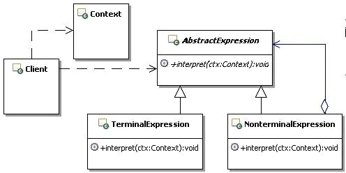
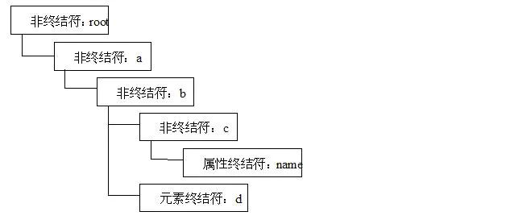
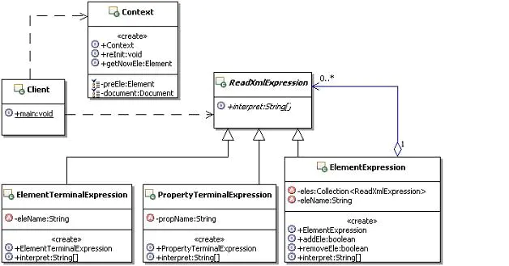
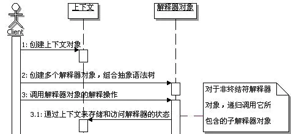

# 1 场景问题

## 1.1 读取配置文件

考虑这样一个实际的应用，维护系统自定义的配置文件。

几乎每个实际的应用系统都有与应用自身相关的配置文件，这个配置文件是由开发人员根据需要自定义的，系统运行时会根据配置的数据进行相应的功能处理。

系统现有的配置数据很简单，主要是JDBC所需要的数据，还有默认读取Spring的配置文件，目前系统只需要一个Spring的配置文件。示例如下：


```xml
<?xml version="1.0" encoding="UTF-8"?>
<root>
    <jdbc>
        <driver-class>驱动类名</driver-class>
        <url>连接数据库的URL</url>
        <user>连接数据库的用户名</user>
        <password>连接数据库的密码</password>
    </jdbc>
    <application-xml>缺省读取的Spring配置的文件名称</application-xml>
</root>
```

现在的功能需求是：如何能够灵活的读取配置文件的内容？

## 1.2 不用模式的解决方案

不就是读取配置文件吗？实现很简单，直接读取并解析xml就可以了。读取xml的应用包很多，这里都不用，直接采用最基础的Dom解析就可以了。另外，读取到xml中的值过后，后续如何处理，这里也不去管，这里只是实现把配置文件读取并解析出来。

按照这个思路，很快就写出了实现的代码，示例代码如下：


```dart
/**
 * 读取配置文件
 */
public class ReadAppXml {
    /**
     * 读取配置文件内容
     * @param filePathName 配置文件的路径和文件名
     * @throws Exception
     */
    public void read(String filePathName)throws Exception{
        Document doc = null;
        //建立一个解析器工厂
        DocumentBuilderFactory factory = DocumentBuilderFactory.newInstance();
        //获得一个DocumentBuilder对象，这个对象代表了具体的DOM解析器
        DocumentBuilder builder=factory.newDocumentBuilder();
        //得到一个表示XML文档的Document对象
        doc=builder.parse(filePathName);
        //去掉XML中作为格式化内容的空白而映射在DOM树中的Text Node对象
        doc.normalize();
      
        //获取jdbc的配置值
        NodeList jdbc = doc.getElementsByTagName("jdbc");
        //只有一个jdbc,获取jdbc中的驱动类的名称
        NodeList driverClassNode = ((Element)jdbc.item(0)).getElementsByTagName("driver-class");
        String driverClass = driverClassNode.item(0).getFirstChild().getNodeValue();
        System.out.println("driverClass=="+driverClass);
        //同理获取url、user、password等的值
        NodeList urlNode = ((Element)jdbc.item(0)).getElementsByTagName("url");
        String url=urlNode.item(0).getFirstChild().getNodeValue();
        System.out.println("url=="+url);
      
        NodeList userNode = ((Element)jdbc.item(0)).getElementsByTagName("user");
        String user = userNode.item(0).getFirstChild().getNodeValue();
        System.out.println("user=="+user);
      
        NodeList passwordNode = ((Element)jdbc.item(0)).getElementsByTagName("password");
        String password = passwordNode.item(0).getFirstChild().getNodeValue();
        System.out.println("password=="+password);
      
        //获取application-xml
        NodeList applicationXmlNode =doc.getElementsByTagName("application-xml");
        String applicationXml = applicationXmlNode.item(0).getFirstChild().getNodeValue();
        System.out.println("applicationXml=="+applicationXml);
    }
}
```

## 1.3 有何问题

看了上面的实现，多简单啊，就是最基本的Dom解析嘛，要是采用其它的开源工具包，比如dom4j、jDom之类的来处理，会更简单，这好像不值得一提呀，真的是这样吗？

请思考一个问题：`如果配置文件的结构需要变动呢？仔细想想，就会感觉出问题来了`。还是先看例子，然后再来总结这个问题。

随着开发的深入进行，越来越多可配置的数据被抽取出来，需要添加到配置文件中，比如与数据库的连接配置：就加入了是否需要、是否使用DataSource等配置。除了这些还加入了一些其它需要配置的数据，例如：系统管理员、日志记录方式、缓存线程的间隔时长、默认读取哪些Spring配置文件等等，示例如下：


```xml
<?xml version="1.0" encoding="UTF-8"?>
<root>
    <database-connection>
        <connection-type>
            连接数据库的类型,1-用Spring集成的方式(也就是不用下面两种方式了),2-DataSource（就是使用JNDI）,3-使用JDBC自己来连接数据库
        </connection-type>
        <jndi>DataSource的方式用，服务器数据源的JNDI名称</jndi>
        <jdbc>跟上面一样，省略了</jdbc>
    </database-connection>
    <system-operator>系统管理员ID</system-operator>
    <log>
        <operate-type>记录日志的方式,1-数据库，2-文件</operate-type>
        <file-name>记录日志的文件名称</file-name>
    </log>
    <thread-interval>缓存线程的间隔时长</thread-interval>
    <spring-default>
        <application-xmls>
            <application-xml>
                缺省读取的Spring配置的文件名称
            </application-xml>
            <application-xml>
                其它需要读取的Spring配置的文件名称
            </application-xml>
        </application-xmls>
    </spring-default>
</root>
```

有朋友可能会想，改变一下配置文件，值得大惊小怪吗？对于应用系统开发来讲，这不是经常发生的、很普通的一件事情嘛。

的确是这样，`改变一下配置文件不是件大事情，但是带来的一系列麻烦也不容忽视`，比如：`修改了配置文件的结构，那么读取配置文件的程序就需要做出相应的变更`；`用来封装配置文件数据的数据对象也需要相应的修改`；`外部使用配置文件的地方，获取数据的地方也会相应变动`。

当然在这一系列麻烦中，`最让人痛苦的莫过于修改读取配置文件的程序了，有时候几乎是重写`。比如在使用Dom读取第一个配置文件，读取默认的Spring配置文件的值的时候，可能的片断代码示例如下：


```csharp
// 获取application-xml
NodeList applicationXmlNode = doc.getElementsByTagName("application-xml");
String applicationXml = applicationXmlNode.item(0).getFirstChild().getNodeValue();
System.out.println("applicationXml=="+applicationXml);
```

但是如果配置文件改成第二个，`文件的结构发生了改变，需要读取的配置文件变成了多个了`，读取的程序也发生了改变，而且application-xml节点也不是直接从doc下获取了。几乎是完全重写了，此时可能的片断代码示例如下：


```dart
//先要获取spring-default，然后获取application-xmls
//然后才能获取application-xml    
NodeList springDefaultNode = doc.getElementsByTagName("spring-default");
NodeList appXmlsNode = ((Element)springDefaultNode.item(0)).getElementsByTagName("application-xmls");
NodeList appXmlNode = ((Element)appXmlsNode.item(0)).getElementsByTagName("application-xml");
//循环获取每个application-xml元素的值
for(int i=0;i<appXmlNode.getLength();i++) {
    String applicationXml = appXmlNode.item(i).getFirstChild().getNodeValue();
    System.out.println("applicationXml=="+applicationXml);
}
```

仔细对比上面在xml变化前后读取值的代码，你会发现，由于xml结构的变化，导致读取xml文件内容的代码，基本上完全重写了。

问题还不仅仅限于读取元素的值，同样体现在读取属性上。可能有些朋友说可以换不同的xml解析方式来简化，不是还有Sax解析，实在不行换用其它开源的解决方案。

确实通过使用不同的解析xml的方式是会让程序变得简单点，但是每次xml的结构发生变化过后，或多或少都是需要修改程序中解析xml部分的。

有没有办法解决这个问题呢？也就是`当xml的结构发生改变过后，能够很方便的获取相应元素、或者是属性的值，而不用再去修改解析xml的程序`。

# 2 解决方案

## 2.1 解释器模式来解决

用来解决上述问题的一个合理的解决方案，就是使用解释器模式。那么什么是解释器模式呢？

1. **解释器模式定义**


解释器模式定义

`这里的文法，简单点说就是我们俗称的“语法规则”`。

1. **应用解释器模式来解决的思路**

要想解决当xml的结构发生改变后，不用修改解析部分的代码，`一个自然的思路就是要把解析部分的代码写成公共的，而且还要是通用的，能够满足各种xml取值的需要`，比如：获取单个元素的值，获取多个相同名称的元素的值，获取单个元素的属性的值，获取多个相同名称的元素的属性的值，等等。

要写成通用的代码，又有几个问题要解决，如何组织这些通用的代码？如何调用这些通用的代码？以何种方式来告诉这些通用代码，客户端的需要？

要解决这些问题，`其中的一个解决方案就是解释器模式`。在描述这个模式的解决思路之前，先解释两个概念，`一个是解析器（不是指xml的解析器），一个是解释器`。

这里的解析器，`指的是把描述客户端调用要求的表达式，经过解析，形成一个抽象语法树的程序，不是指xml的解析器`。

这里的解释器，`指的是解释抽象语法树，并执行每个节点对应的功能的程序`。

要解决通用解析xml的问题：

> 第一步：`需要先设计一个简单的表达式语言，在客户端调用解析程序的时候，传入用这个表达式语言描述的一个表达式，然后把这个表达式通过解析器的解析，形成一个抽象的语法树`。
>
> 第二步：`解析完成后，自动调用解释器来解释抽象语法树，并执行每个节点所对应的功能，从而完成通用的xml解析`。

这样一来，每次当xml结构发生了更改，也就是在客户端调用的时候，传入不同的表达式即可，整个解析xml过程的代码都不需要再修改了。

## 2.2 模式结构和说明

解释器模式的结构如图所示：



解释器模式结构图

> AbstractExpression：`定义解释器的接口，约定解释器的解释操作`。
>
> TerminalExpression：`终结符解释器`，用来实现语法规则中和终结符相关的操作，`不再包含其它的解释器`，如果用组合模式来构建抽象语法树的话，`就相当于组合模式中的叶子对象，可以有多种终结符解释器`。
>
> NonterminalExpression：`非终结符解释器`，用来实现语法规则中非终结符相关的操作，`通常一个解释器对应一个语法规则，可以包含其它的解释器`，如果用组合模式来构建抽象语法树的话，`就相当于组合模式中的组合对象，可以有多种非终结符解释器`。
>
> Context：`上下文，通常包含各个解释器需要的数据，或是公共的功能`。
>
> Client：客户端，`指的是使用解释器的客户端`，通常在这里去把按照语言的语法做的表达式，转换成为使用解释器对象描述的抽象语法树，然后调用解释操作。

## 2.3 解释器模式示例代码

1. **先看看抽象表达式的定义，非常简单，`定义一个执行解释的方法`，示例代码如下：**


```csharp
/**
 * 抽象表达式
 */
public abstract class AbstractExpression {
    /**
     * 解释的操作
     * @param ctx 上下文对象
     */
    public abstract void interpret(Context ctx);
}
```

1. **再来看看终结符表达式的定义，示例代码如下：**


```java
/**
 * 终结符表达式
 */
public class TerminalExpression extends AbstractExpression{
    public void interpret(Context ctx) {
       //实现与语法规则中的终结符相关联的解释操作
    }
}
```

1. **接下来该看看非终结符表达式的定义了，示例代码如下：**


```java
/**
 * 非终结符表达式
 */
public class NonterminalExpression extends AbstractExpression{
    public void interpret(Context ctx) {
       //实现与语法规则中的非终结符相关联的解释操作
    }
}
```

1. **上下文的定义，示例代码如下：**


```cpp
/**
 * 上下文，包含解释器之外的一些全局信息
 */
public class Context {
}
```

1. **最后来看看客户端的定义，示例代码如下：**


```cpp
/**
 * 使用解释器的客户
 */
public class Client {
    //主要按照语法规则对特定的句子构建抽象语法树
    //然后调用解释操作
}
```

看到这里，可能有些朋友会觉得，上面的示例代码里面什么都没有啊。`这主要是因为解释器模式是跟具体的语法规则联系在一起的，没有相应的语法规则，自然写不出对应的处理代码来`。

但是这些示例还是有意义的，可以通过它们看出解释器模式实现的基本架子，只是没有内部具体的处理罢了。

## 2.4 使用解释器模式重写示例

通过上面的讲述可以看出，要使用解释器模式，`一个重要的前提就是要定义一套语法规则，也称为文法`。不管这套文法的规则是简单还是复杂，必须有这么个东西，`因为解释器模式就是来按照这些规则进行解析并执行相应的功能的`。

1. **为表达式设计简单的文法**

为了通用，用root表示根元素，a、b、c、d等来代表元素，一个简单的xml如下：


```xml
<?xml version="1.0" encoding="UTF-8"?>
<root id="rootId">
    <a>
        <b>
            <c name="testC">12345</c>
            <d id="1">d1</d>
            <d id="2">d2</d>
            <d id="3">d3</d>
            <d id="4">d4</d>
        </b>
    </a>
</root>
```

**约定表达式的文法如下：**

> **获取单个元素的值：**从根元素开始，一直到想要获取值的元素，元素中间用“/”分隔，根元素前不加“/”。比如表达式“root/a/b/c”就表示获取根元素下、a元素下、b元素下的c元素的值；
>
> **获取单个元素的属性的值：**要获取值的属性一定是表达式的最后一个元素的属性，在最后一个元素后面添加“.”然后再加上属性的名称。比如表达式“root/a/b/c.name”就表示获取根元素下、a元素下、b元素下、c元素的name属性的值；
>
> **获取相同元素名称的值，当然是多个：**要获取值的元素一定是表达式的最后一个元素，在最后一个元素后面添加“$”。比如表达式“root/a/b/d$”就表示获取根元素下、a元素下、b元素下的多个d元素的值的集合；
>
> **获取相同元素名称的属性的值，当然也是多个：**要获取属性值的元素一定是表达式的最后一个元素，在最后一个元素后面添加“$”，然后在后面添加“.”然后再加上属性的名称，在属性名称后面也添加“$”。比如表达式“root/a/b/d$.id$”就表示获取根元素下、a元素下、b元素下的多个d元素的id属性的值的集合；

1. **示例说明**

为了示例的通用性，就使用上面这个xml来实现功能，不去使用前面定义的具体的xml了，解决的方法是一样的。

另外一个问题，`解释器模式主要解决的是“解释抽象语法树，并执行每个节点所对应的功能”，并不包含如何从一个表达式转换成为抽象的语法树`。因此下面的范例就先来实现解释器模式所要求的功能。至于如何从一个表达式转换成为相应的抽象语法树，后面会给出一个示例。

`对于抽象的语法树这个树状结构，很明显可以使用组合模式来构建`。`解释器模式把需要解释的对象分成了两大类，一类是节点元素`，就是可以包含其它元素的组合元素，比如非终结符元素，对应成为组合模式的Composite；`另一类是终结符元素，相当于组合模式的叶子对象`。解释整个抽象语法树的过程，也就是执行相应对象的功能的过程。

比如上面的xml，对应成为抽象语法树，可能的结构如下图所示：



xml对应的抽象语法树示意图

1. **具体示例**

从简单的开始，先来演示获取单个元素的值和单个元素的属性的值。在看具体代码前，先来看看此时系统的整体结构，如图所示：



解释器模式示例的结构示意图

**（1）定义抽象的解释器**

要实现解释器的功能，`首先定义一个抽象的解释器，来约束所有被解释的语法对象，也就是节点元素和终结符元素都要实现的功能`。示例代码如下：


```dart
/**
 * 用于处理自定义Xml取值表达式的接口
 */
public abstract class ReadXmlExpression {
    /**
     * 解释表达式
     * @param c 上下文
     * @return 解析过后的值，为了通用，可能是单个值，也可能是多个值，
     *         因此就返回一个数组
     */
    public abstract String[] interpret(Context c);
}
```

**（2）定义上下文**

`上下文是用来封装解释器需要的一些全局数据，也可以在里面封装一些解释器的公共功能，可以相当于各个解释器的公共对象`，示例代码如下：


```dart
/**
 *  上下文，用来包含解释器需要的一些全局信息
 */
public class Context {
    /**
     * 上一个被处理的元素
     */
    private Element preEle = null;
    /**
     * Dom解析Xml的Document对象
     */
    private Document document = null;
    /**
     * 构造方法
     * @param filePathName 需要读取的xml的路径和名字
     * @throws Exception
     */
    public Context(String filePathName) throws Exception{
       //通过辅助的Xml工具类来获取被解析的xml对应的Document对象
       this.document = XmlUtil.getRoot(filePathName);
    }
    /**
     * 重新初始化上下文
     */
    public void reInit(){
       preEle = null;
    }
    /**
     * 各个Expression公共使用的方法,
     * 根据父元素和当前元素的名称来获取当前的元素
     * @param pEle 父元素
     * @param eleName 当前元素的名称
     * @return 找到的当前元素
     */
    public Element getNowEle(Element pEle,String eleName){
       NodeList tempNodeList = pEle.getChildNodes();
       for(int i=0;i<tempNodeList.getLength();i++){
           if(tempNodeList.item(i) instanceof Element){
              Element nowEle = (Element)tempNodeList.item(i);
              if(nowEle.getTagName().equals(eleName)){
                  return nowEle;
              }
           }
       }
       return null;
    }
  
    public Element getPreEle() {
       return preEle;
    }
    public void setPreEle(Element preEle) {
       this.preEle = preEle;
    }
  
    public Document getDocument() {
       return document;
    }
}
```

`在上下文中使用了一个工具对象XmlUtil来获取Document对象`，就是Dom解析xml，获取相应的Document对象，示例如下：


```java
public class XmlUtil {
    public static Document getRoot(String filePathName) throws Exception{
        Document doc = null;
        //建立一个解析器工厂
        DocumentBuilderFactory factory = DocumentBuilderFactory.newInstance();
        //获得一个DocumentBuilder对象，这个对象代表了具体的DOM解析器
        DocumentBuilder builder=factory.newDocumentBuilder();
        //得到一个表示XML文档的Document对象
        doc=builder.parse(filePathName);
        //去掉XML文档中作为格式化内容的空白而映射在DOM树中的TextNode对象
        doc.normalize();

        return doc;
    }
}
```

**（3）定义元素作为非终结符对应的解释器**

接下来该看看如何解释执行中间元素了，`首先这个元素相当于组合模式的Composite对象，因此需要对子元素进行维护，另外这个元素的解释处理，只是需要把自己找到，作为下一个元素的父元素就好了`。示例代码如下：


```csharp
/**
 * 元素作为非终结符对应的解释器，解释并执行中间元素
 */
public class ElementExpression extends ReadXmlExpression{
    /**
     * 用来记录组合的ReadXmlExpression元素
     */
    private Collection<ReadXmlExpression> eles = new ArrayList<ReadXmlExpression>();
    /**
     * 元素的名称
     */
    private String eleName = "";

    public ElementExpression(String eleName){
       this.eleName = eleName;
    }
    public boolean addEle(ReadXmlExpression ele){
       this.eles.add(ele);
       return true;
    }
    public boolean removeEle(ReadXmlExpression ele){
       this.eles.remove(ele);
       return true;
    }  
    public String[] interpret(Context c) {
       //先取出上下文里的当前元素作为父级元素
       //查找到当前元素名称所对应的xml元素，并设置回到上下文中
       Element pEle = c.getPreEle();
       if(pEle==null){
           //说明现在获取的是根元素
           c.setPreEle(c.getDocument().getDocumentElement());
       }else{
           //根据父级元素和要查找的元素的名称来获取当前的元素
           Element nowEle = c.getNowEle(pEle, eleName);
           //把当前获取的元素放到上下文里面
           c.setPreEle(nowEle);
       }
     
       //循环调用子元素的interpret方法
       String [] ss = null;
       for(ReadXmlExpression ele : eles){
           ss = ele.interpret(c);
       }
       return ss;
    }
}
```

**（4）定义元素作为终结符对应的解释器**

对于单个元素的处理，终结符有两种，`一个是元素终结，一个是属性终结`。如果是元素终结，就是要获取元素的值；如果是属性终结，就是要获取属性的值。

分别来看看如何实现的，先看元素作为终结的解释器，示例代码如下：


```dart
/**
 * 元素作为终结符对应的解释器
 */
public class ElementTerminalExpression  extends ReadXmlExpression{
    /**
     * 元素的名字
     */
    private String eleName = "";

    public ElementTerminalExpression(String name){
        this.eleName = name;
    }  

    public String[] interpret(Context c) {
        //先取出上下文里的当前元素作为父级元素
        Element pEle = c.getPreEle();
        //查找到当前元素名称所对应的xml元素
        Element ele = null;
        if(pEle==null){
            //说明现在获取的是根元素
            ele = c.getDocument().getDocumentElement();
            c.setPreEle(ele);
        }else{
            //根据父级元素和要查找的元素的名称来获取当前的元素
            ele = c.getNowEle(pEle, eleName);
            //把当前获取的元素放到上下文里面
            c.setPreEle(ele);
        }

        //然后需要去获取这个元素的值
        String[] ss = new String[1];
        ss[0] = ele.getFirstChild().getNodeValue();
        return ss;
    }
}
```

**（5）定义属性作为终结符对应的解释器**

接下来看看属性终结符的实现，就会比较简单，直接获取最后的元素对象，然后获取相应的属性的值，示例代码如下：


```tsx
/**
 * 属性作为终结符对应的解释器
 */
public class PropertyTerminalExpression extends ReadXmlExpression{
    /**
     * 属性的名字
     */
    private String propName;
    public PropertyTerminalExpression(String propName){
        this.propName = propName;
    }
    public String[] interpret(Context c) {
        //直接获取最后的元素的属性的值
        String[] ss = new String[1];
        ss[0] = c.getPreEle().getAttribute(this.propName);
        return ss;
    }
}
```

**（6）使用解释器**

定义好了各个解释器的实现，可以写个客户端来测试一下这些解释器对象的功能了。使用解释器的客户端的工作会比较多，`最主要的就是要组装抽象的语法树`。

先来看看如何使用解释器获取单个元素的值，示例代码如下：


```csharp
public class Client {
    public static void main(String[] args) throws Exception {
        //准备上下文
        Context c = new Context("InterpreterTest.xml");     

        //想要获取c元素的值，也就是如下表达式的值："root/a/b/c"
        //首先要构建解释器的抽象语法树
        ElementExpression root = new ElementExpression("root");
        ElementExpression aEle = new ElementExpression("a");
        ElementExpression bEle = new ElementExpression("b");
        ElementTerminalExpression cEle = new ElementTerminalExpression("c");
        //组合起来
        root.addEle(aEle);
        aEle.addEle(bEle);
        bEle.addEle(cEle);
        //调用
        String ss[] = root.interpret(c);
        System.out.println("c的值是="+ss[0]);
    }
}
```

把前面定义的xml取名叫作“InterpreterTest.xml”，放到当前工程的根下面，运行看看，能正确获取值吗，运行的结果如下：


```swift
c的值是=12345
```

再来测试一下获取单个元素的属性的值，示例代码如下：


```csharp
public class Client {
    public static void main(String[] args) throws Exception {
        //准备上下文
        Context c = new Context("InterpreterTest.xml");

        //想要获取c元素的name属性，也就是如下表达式的值："root/a/b/c.name"
        //这个时候c不是终结了，需要把c修改成ElementExpressioin
        ElementExpression root = new ElementExpression("root");
        ElementExpression aEle = new ElementExpression("a");
        ElementExpression bEle = new ElementExpression("b");
        ElementExpression cEle = new ElementExpression("c");
        PropertyTerminalExpression prop = new PropertyTerminalExpression("name");
        //组合
        root.addEle(aEle);
        aEle.addEle(bEle);
        bEle.addEle(cEle);
        cEle.addEle(prop);
        //调用
        String ss[] = root.interpret(c);
        System.out.println("c的属性name的值是="+ss[0]);
     
        //如果要使用同一个上下文，连续进行解析，需要重新初始化上下文对象
        //比如要连续的重新再获取一次属性name的值，当然你可以重新组合元素，
        //重新解析，只要是在使用同一个上下文，就需要重新初始化上下文对象
        c.reInit();
        String ss2[] = root.interpret(c);
        System.out.println("重新获取c的属性name的值是="+ss2[0]);
    }
}
```

运行的结果如下：


```swift
c的属性name的值是=testC
重新获取c的属性name的值是=testC
```

就像前面讲述的那样，`制定一种简单的语言，让客户端用来表达从xml中取值的表达式的语言，然后为它们定义一种文法的表示，也就是语法规则，然后用解释器对象来表示那些表达式，接下来通过运行解释器来解释并执行这些功能`。

但是从前面的示例中，`我们只能看到客户端直接使用解释器对象，来表示客户要从xml中取什么值的语法树，而没有看到如何从语言的表达式转换成为这种解释器的表示，这个功能是属于解析器的功能`，没有划分在标准的解释器模式中，所以这里就先不演示，在后面会有示例来讲解析器。

# 3 模式讲解

## 3.1 认识解释器模式

1. **解释器模式的功能**

`解释器模式使用解释器对象来表示和处理相应的语法规则，一般一个解释器处理一条语法规则`。理论上来说，`只要能用解释器对象把符合语法的表达式表示出来，而且能够构成抽象的语法树，那都可以使用解释器模式来处理`。

1. **语法规则和解释器**

`语法规则和解释器之间是有对应关系的，一般一个解释器处理一条语法规则`，但是反过来并不成立，一条语法规则是可以有多种解释和处理的，也就是一条语法规则可以对应多个解释器对象。

1. **上下文的公用性**

上下文在解释器模式中起到非常重要的作用，`由于上下文会被传递到所有的解释器中，因此可以在上下文中存储和访问解释器的状态`，比如前面的解释器可以存储一些数据在上下文中，后面的解释器就可以获取这些值。

另外还可以通过上下文传递一些在解释器外部，但是解释器需要的数据，`也可以是一些全局的，公共的数据`。

上下文还有一个功能，`就是可以提供所有解释器对象的公共功能，类似于对象组合，而不是使用继承来获取公共功能，在每个解释器对象里面都可以调用`。

1. **谁来构建抽象语法树**

在前面的示例中，大家已经发现，自己在客户端手工来构建抽象语法树，是很麻烦的，但是在解释器模式中，并没有涉及这部分功能，只是负责对构建好的抽象语法树进行解释处理。前面的测试简单，所以手工构建抽象语法树也不是特别困难的事，要是复杂了呢？如果还是手工创建，那跟修改解析xml的代码也差不了多少。后面会给大家讲到，可以提供解析器来实现把表达式转换成为抽象语法树。

还有一个问题，`就是一条语法规则是可以对应多个解释器对象的，也就是说同一个元素，是可以转换成多个解释器对象的，这也就意味着同样一个表达式，是可以构成不同的抽象语法树的，这也造成构建抽象语法树变得很困难，而且工作量很大`。

1. **谁负责解释操作**

`只要定义好了抽象语法树，肯定是解释器来负责解释执行`。虽然有不同的语法规则，但是`解释器不负责选择究竟用哪一个解释器对象来解释执行语法规则，选择解释器的功能在构建抽象语法树的时候就完成了`。

所以解释器只要忠实的按照抽象语法树解释执行就好了。

1. **解释器模式的调用顺序示意图**

解释器模式的调用顺序如图所示：



解释器模式的调用顺序示意图

## 3.2 读取多个元素或属性的值

前面看过了如何获取单个元素的值和单个元素的属性的值，下面应该来看看如何获取多个元素的值，还有多个元素中相同名称的属性的值了。

`获取多个值和前面获取单个值的实现思路大致相同，只是在取值的时候需要循环整个NodelList，依次取值，而不是只取出第一个来`。当然，由于语法发生了变动，所以对应的解释器也需要发生改变。

首先是有了一个表示多个元素作为终结符的语法，比如“root/a/b/d$”中的“d$”；其次有了一个表示多个元素的属性作为终结符的语法，比如“root/a/b/d$.id$”中的“.id$”；最后还有一个表示多个元素，但不是终结符的语法，比如“root/a/b/d$.id$”中的“d$”。

还是看看代码示例吧，会比较清楚。

1. **解释器接口没有变化，原本就定义的是数组，早做好准备了。**
2. **读取Xml的工具类XmlUtil也没有任何变化。**
3. **上下文做了一点改变。**

> 把原来用来记录上一次操作的元素，`变成记录上一次操作的多个元素的这么一个集合`，然后为它提供相应的getter/setter方法；
>
> 另外，原来根据父元素和当前元素的名称获取当前元素的方法，`变成了根据父元素和当前元素的名称来获取多个元素`；
>
> 重新初始化上下文的方法里面，`初始化的就是记录上一次操作的多个元素的这个集合了`；

具体的Context类的代码示例如下：


```dart
/**
 *  上下文，用来包含解释器需要的一些全局信息
 */
public class Context {
    /**
     * Dom解析Xml的Document对象
     */
    private Document document = null;
    /**
     * 上一次被处理的多个元素
     */
    private List<Element> preEles = new ArrayList<Element>();
    /**
     * 构造方法
     * @param filePathName 需要读取的xml的路径和名字
     * @throws Exception
     */
    public Context(String filePathName) throws Exception{
       //通过辅助的Xml工具类来获取被解析的xml对应的Document对象
       this.document = XmlUtil.getRoot(filePathName);
    }
    /**
     * 重新初始化上下文
     */
    public void reInit(){
       preEles = new ArrayList<Element>();
    }
    /**
     * 各个Expression公共使用的方法,
     * 根据父元素和当前元素的名称来获取当前的多个元素的集合
     * @param pEle 父元素
     * @param eleName 当前元素的名称
     * @return 当前的多个元素的集合
     */
    public List<Element> getNowEles(Element pEle,String eleName){
       List<Element> elements = new ArrayList<Element>();
       NodeList tempNodeList = pEle.getChildNodes();
       for(int i=0;i<tempNodeList.getLength();i++){
           if(tempNodeList.item(i) instanceof Element){
              Element nowEle = (Element)tempNodeList.item(i);
              if(nowEle.getTagName().equals(eleName)){
                  elements.add(nowEle);
              }
           }
       }
       return elements;
    }
  
    public Document getDocument() {
       return document;
    }
    public List<Element> getPreEles() {
       return preEles;
    }
    public void setPreEles(List<Element> nowEles) {
       this.preEles = nowEles;
    }
}
```

1. **处理单个非终结符的对象ElementExpression，跟以前处理单个元素相比，主要是现在需要面向多个父元素，但是由于是单个非终结符的处理，因此在多个父元素下面去查找符合要求的元素，找到一个就停止，示例代码如下：**


```dart
/**
 * 单个元素作为非终结符的解释器
 */
public class ElementExpression extends ReadXmlExpression{
    /**
     * 用来记录组合的ReadXmlExpression元素
     */
    private Collection<ReadXmlExpression> eles = new ArrayList<ReadXmlExpression>();
    /**
     * 元素的名称
     */
    private String eleName = "";

    public ElementExpression(String eleName){
       this.eleName = eleName;
    }
    public boolean addEle(ReadXmlExpression ele){
       this.eles.add(ele);
       return true;
    }
    public boolean removeEle(ReadXmlExpression ele){
       this.eles.remove(ele);
       return true;
    }
  
    public String[] interpret(Context c) {
       //先取出上下文里的父级元素
       List<Element> pEles = c.getPreEles();
       Element ele = null;

       //把当前获取的元素放到上下文里面
       List<Element> nowEles = new ArrayList<Element>();      
       if(pEles.size()==0){
           //说明现在获取的是根元素
           ele = c.getDocument().getDocumentElement();
           pEles.add(ele);
           c.setPreEles(pEles);
       }else{
           for(Element tempEle : pEles){
              nowEles.addAll(c.getNowEles(tempEle, eleName));
              if(nowEles.size()>0){
                  //找到一个就停止
                  break;
              }
           }
           List<Element> tempList = new ArrayList<Element>();
           tempList.add(nowEles.get(0));
           c.setPreEles(tempList);
       }
     
       //循环调用子元素的interpret方法
       String [] ss = null;
       for(ReadXmlExpression tempEle : eles){
           ss = tempEle.interpret(c);
       }
       return ss;
    }
}
```

1. **用来处理单个元素作为终结符的类，也发生了一点改变，主要是从多个父元素去获取当前元素，如果当前元素是多个，就取第一个，示例代码如下：**


```dart
/**
 * 元素作为终结符对应的解释器
 */
public class ElementTerminalExpression  extends ReadXmlExpression{
    /**
     * 元素的名字
     */
    private String eleName = "";
    public ElementTerminalExpression(String name){
       this.eleName = name;
    }
  
    public String[] interpret(Context c) {
       //先取出上下文里的当前元素作为父级元素
       List<Element> pEles = c.getPreEles();
       //查找到当前元素名称所对应的xml元素
       Element ele = null;
       if(pEles.size() == 0){
           //说明现在获取的是根元素
           ele = c.getDocument().getDocumentElement();
       }else{
           //获取当前的元素
           ele = c.getNowEles(pEles.get(0), eleName).get(0);
       }

       //然后需要去获取这个元素的值
       String[] ss = new String[1];
       ss[0] = ele.getFirstChild().getNodeValue();
       return ss;
    }
}
```

1. **新添加一个解释器，用来解释处理以多个元素的属性作为终结符的情况，它的实现比较简单，只要获取到最后的多个元素对象，然后循环这些元素，一个一个取出相应的属性值就好了，示例代码如下：**


```dart
/**
 * 以多个元素的属性做为终结符的解释处理对象
 */
public class PropertysTerminalExpression extends ReadXmlExpression{
    /**
     * 属性名字
     */
    private String propName;
    public PropertysTerminalExpression(String propName){
       this.propName = propName;
    }
  
    public String[] interpret(Context c) {
       //获取最后的多个元素
       List<Element> eles = c.getPreEles();
     
       String[] ss = new String[eles.size()];
       //循环多个元素，获取每个的属性的值
       for(int i=0;i<ss.length;i++){
           ss[i] = eles.get(i).getAttribute(this.propName);
       }
       return ss;
    }
}
```

1. **新添加一个解释器，用来解释处理以多个元素作为终结符的情况，示例代码如下：**


```dart
/**
 * 以多个元素作为终结符的解释处理对象
 */
public class ElementsTerminalExpression extends ReadXmlExpression{
    /**
     * 元素的名称
     */
    private String eleName = "";
    public ElementsTerminalExpression(String name){
       this.eleName = name;
    }
  
    public String[] interpret(Context c) {
       //先取出上下文里的父级元素
       List<Element> pEles = c.getPreEles();
       //获取当前的多个元素
       List<Element> nowEles = new ArrayList<Element>();
     
       for(Element ele : pEles){
           nowEles.addAll(c.getNowEles(ele, eleName));
       }

       //然后需要去获取这些元素的值
       String[] ss = new String[nowEles.size()];
       for(int i=0;i<ss.length;i++){
           ss[i] = nowEles.get(i).getFirstChild().getNodeValue();
       }
       return ss;
    }
}
```

1. **新添加一个解释器，用来解释处理以多个元素作为非终结符的情况，它的实现类似于以单个元素作为非终结符的情况，只是这次处理的是多个，需要循环处理，同样需要维护子对象，在我们现在设计的语法中，多个元素后面是可以再加子元素的，最起码可以加多个属性的终结符对象，示例代码如下：**


```csharp
/**
 * 多个元素做为非终结符的解释处理对象
 */
public class ElementsExpression extends ReadXmlExpression{
    /**
     * 用来记录组合的ReadXmlExpression元素
     */
    private Collection<ReadXmlExpression> eles = new ArrayList<ReadXmlExpression>();
    /**
     * 元素名字
     */
    private String eleName = "";
    public ElementsExpression(String eleName){
       this.eleName = eleName;
    }
  
    public String[] interpret(Context c) {
       //先取出上下文里的父级元素
       List<Element> pEles = c.getPreEles();
       //把当前获取的元素放到上下文里面，这次是获取多个元素
       List<Element> nowEles = new ArrayList<Element>();
     
       for(Element ele : pEles){
           nowEles.addAll(c.getNowEles(ele, eleName));
       }
       c.setPreEles(nowEles);
     
       //循环调用子元素的interpret方法
       String [] ss = null;
       for(ReadXmlExpression ele : eles){
           ss = ele.interpret(c);
       }
       return ss;
    }
  
    public boolean addEle(ReadXmlExpression ele){
       this.eles.add(ele);
       return true;
    }
    public boolean removeEle(ReadXmlExpression ele){
       this.eles.remove(ele);
       return true;
    }
}
```

1. **终于可以写客户端来测试一下了，看看是否能实现期望的功能。先测试获取多个元素的值的情况，示例代码如下：**


```csharp
public class Client {
    public static void main(String[] args) throws Exception {
       //准备上下文
       Context c = new Context("InterpreterTest.xml");
       //想要获取多个d元素的值，也就是如下表达式的值："root/a/b/d$"
       //首先要构建解释器的抽象语法树
       ElementExpression root = new ElementExpression("root");
       ElementExpression aEle = new ElementExpression("a");
       ElementExpression bEle = new ElementExpression("b");
       ElementsTerminalExpression dEle = new ElementsTerminalExpression("d");
       //组合起来
       root.addEle(aEle);
       aEle.addEle(bEle);
       bEle.addEle(dEle);      
       //调用
       String ss[] = root.interpret(c);
       for(String s : ss){
           System.out.println("d的值是="+s);  
       }
    }
}
```

运行结果如下：


```undefined
d的值是=d1
d的值是=d2
d的值是=d3
d的值是=d4
```

接下来测试一下获取多个属性值的情况，示例代码如下：


```csharp
public class Client {
    public static void main(String[] args) throws Exception {
        //准备上下文
        Context c = new Context("InterpreterTest.xml");

        //想要获取d元素的id属性，也就是如下表达式的值："a/b/d$.id$"
        //首先要构建解释器的抽象语法树
        ElementExpression root = new ElementExpression("root");
        ElementExpression aEle = new ElementExpression("a");
        ElementExpression bEle = new ElementExpression("b");
        ElementsExpression dEle = new ElementsExpression("d");
        PropertysTerminalExpression prop = new PropertysTerminalExpression("id");
        //组合
        root.addEle(aEle);
        aEle.addEle(bEle);
        bEle.addEle(dEle);
        dEle.addEle(prop);

        //调用
        String ss[] = root.interpret(c);
        for (String s : ss) {
            System.out.println("d的属性id值是=" + s);
        }
    }
}
```

运行结果如下：


```objectivec
d的属性id值是=1
d的属性id值是=2
d的属性id值是=3
d的属性id值是=4
```

也很简单，是不是。只要学会了处理单个的值，处理多个值也就变得容易了，只要把原来获取单个值的地方改成循环操作即可。

当然，`如果要使用同一个上下文，连续进行解析，是同样需要重新初始化上下文对象的`。你还可以尝试一下，如果是想要获取多个元素下的，多个元素的同一个属性的值，能实现吗？你自己去测试，应该是可以实现的。

## 3.3 解析器

前面看完了解释器部分的功能，看到只要构建好了抽象语法树，解释器就能够正确地解释并执行它，但是该如何得到这个抽象语法树呢？前面的测试都是人工组合好抽象语法树的，如果实际开发中还这样做，基本上工作量跟修改解析xml的代码差不多。

```
这就需要解析器出场了，这个程序专门负责把按照语法表达的表达式，解析转换成为解释器需要的抽象语法树。当然解析器是跟表达式的语法，还有解释器对象紧密关联的。
```

下面来示例一下解析器的实现，`把符合前面定义的语法的表达式，转换成为前面实现的解释器的抽象语法树`。解析器有很多种实现方式，没有什么定式，只要能完成相应的功能即可，比如表驱动、语法分析生成程序等等。这里的示例采用自己来分解表达式以实现构建抽象语法树的功能，没有使用递归，是用循环实现的，当然也可以用递归来做。

1. **实现思路**

要实现解析器也不复杂，大约有下面三个步骤：

> 第一步：把客户端传递来的表达式进行分解，分解成为一个一个的元素，并用一个对应的解析模型来封装这个元素的一些信息；
>
> 第二步：根据每个元素的信息，转化成相对应的解析器对象；
>
> 第三步：按照先后顺序，把这些解析器对象组合起来，就得到抽象语法树了；

可能有朋友会说，为什么不把第一步和第二步合并，直接分解出一个元素就转换成相应的解析器对象呢？原因有两个：

> 其一是功能分离，不要让一个方法的功能过于复杂；
>
> 其二是为了今后的修改和扩展，现在语法简单，所以转换成解析器对象需要考虑的东西少，直接转换也不难，但要是语法复杂了，直接转换就很杂乱了；

```
事实上，封装解析属性的数据模型充当了第一步和第二步操作间的接口，使第一步和第二步都变简单了。
```

1. **先来看看用来封装每一个解析出来的元素对应的属性对象，示例代码如下：**


```java
/**
 * 用来封装每一个解析出来的元素对应的属性
 */
public class ParserModel {
    /**
     * 是否单个值
     */
    private boolean singleVlaue;
    /**
     * 是否属性，不是属性就是元素
     */
    private boolean propertyValue;
    /**
     * 是否终结符
     */
    private boolean end;
    public boolean isEnd() {
       return end;
    }
    public void setEnd(boolean end) {
       this.end = end;
    }
    public boolean isSingleVlaue() {
       return singleVlaue;
    }
    public void setSingleVlaue(boolean oneVlaue) {
       this.singleVlaue = oneVlaue;
    }
    public boolean isPropertyValue() {
       return propertyValue;
    }
    public void setPropertyValue(boolean propertyValue) {
       this.propertyValue = propertyValue;
    }
}
```

1. **看看解析器的实现，代码稍微复杂点，注释很详尽，为了整体展示解析器，就不去分开每步单讲了，不过要注意一点：下面这种实现没有考虑并发处理的情况，如果要用在多线程环境下，需要补充相应的处理，特别提示一下。示例代码如下：**


```dart
/**
 * 根据语法来解析表达式，转换成为相应的抽象语法树
 */
public class Parser {
    /**
     * 私有化构造器，避免外部无谓的创建对象实例
     */
    private Parser(){
       //
    }
    //定义几个常量，内部使用
    private final static String BACKLASH = "/";
    private final static String DOT = ".";
    private final static String DOLLAR = "$";
    /**
     * 按照分解的先后记录需要解析的元素的名称
     */
    private static List<String> listEle = null;

    /**
     * 传入一个字符串表达式，通过解析，组合成为一个抽象的语法树
     * @param expr 描述要取值的字符串表达式
     * @return 对应的抽象语法树
     */
    public static ReadXmlExpression parse(String expr){
        //先初始化记录需解析的元素的名称的集 会
        listEle = new ArrayList<String>();

        //第一步：分解表达式，得到需要解析的元素名称和该元素对应的解析模型
        Map<String,ParserModel> mapPath = parseMapPath(expr);
     
        //第二步：根据节点的属性转换成为相应的解释器对象
        List<ReadXmlExpression> list = mapPath2Interpreter(mapPath);
        //第三步：组合抽象语法树，一定要按照先后顺序来组合，
        //否则对象的包含关系就乱了
        ReadXmlExpression returnRe = buildTree(list);
  
        return returnRe;        
    }
    /*----------------------开始实现第一步-----------------------*/
    /**
     * 按照从左到右顺序来分解表达式，得到需要解析的元素名称，
     * 还有该元素对应的解析模型
     * @param expr 需要分解的表达式
     * @return 得到需要解析的元素名称，还有该元素对应的解析模型
     */
    private static Map<String,ParserModel> parseMapPath(String expr){
        //先按照/分割字符串
        StringTokenizer tokenizer = new StringTokenizer(expr, BACKLASH);
        //初始化一个map用来存放分解出来的值
        Map<String,ParserModel> mapPath = new HashMap<String,ParserModel>();
        while (tokenizer.hasMoreTokens()) {
            String onePath = tokenizer.nextToken();
            if (tokenizer.hasMoreTokens()) {
               //还有下一个值，说明这不是最后一个元素
               //按照现在的语法，属性必然在最后，因此也不是属性
               setParsePath(false,onePath,false,mapPath);
            } else {
               //说明到最后了
               int dotIndex = onePath.indexOf(DOT);
               if (dotIndex > 0) {
                   //说明是要获取属性的值，那就按照"."来分割，
                   //前面的就是元素名字，后面的是属性的名字
                   String eleName = onePath.substring(0, dotIndex);
                   String propName = onePath.substring(dotIndex + 1);
                   //设置属性前面的那个元素，自然不是最后一个，也不是属性
                   setParsePath(false,eleName,false,mapPath);
                   //设置属性，按照现在的语法定义，属性只能是最后一个
                   setParsePath(true,propName,true,mapPath);
               } else {
                   //说明是取元素的值，而且是最后一个元素的值
                   setParsePath(true,onePath,false,mapPath);
               }
               break;
            }
        }
        return mapPath;
    }
    /**
     * 按照分解出来的位置和名称来设置需要解析的元素名称，
     * 还有该元素对应的解析模型
     * @param end 是否是最后一个
     * @param ele 元素名称
     * @param propertyValue 是否是取属性
     * @param mapPath 设置需要解析的元素名称，还有该元素对应的解析模型的Map
     */
    private static void setParsePath(boolean end,String ele,boolean propertyValue,Map<String,ParserModel> mapPath){
        ParserModel pm = new ParserModel();
        pm.setEnd(end);
        //如果带有$符号就说明不是一个值
        pm.setSingleVlaue(!(ele.indexOf(DOLLAR)>0));
        pm.setPropertyValue(propertyValue);             
        //去掉$
        ele = ele.replace(DOLLAR, "");
        mapPath.put(ele,pm);
        listEle.add(ele);
    }
    /*----------------------第一步实现结束-----------------------*/

    /*----------------------开始实现第二步-----------------------*/  
    /**
     * 把分解出来的元素名称，根据对应的解析模型转换成为相应的解释器对象
     * @param mapPath 分解出来的需解析的元素名称，还有该元素对应的解析模型
     * @return 把每个元素转换成为相应的解释器对象后的集合
     */
    private static List<ReadXmlExpression> mapPath2Interpreter(Map<String,ParserModel> mapPath){
        List<ReadXmlExpression> list = new ArrayList<ReadXmlExpression>();
        //一定要按照分解的先后顺序来转换成解释器对象
        for(String key : listEle){
            ParserModel pm = mapPath.get(key);
            ReadXmlExpression obj = null;
            if(!pm.isEnd()){
               if(pm.isSingleVlaue()){
                   //不是最后一个，是一个值，转化为
                   obj = new ElementExpression(key);            
               }else{
                   //不是最后一个，是多个值，转化为
                   obj = new ElementsExpression(key);
               }
            }else{
               if(pm.isPropertyValue()){
                   if(pm.isSingleVlaue()){
                      //是最后一个，是一个值，取属性的值，转化为
                      obj = new PropertyTerminalExpression(key);
                   }else{
                      //是最后一个，是多个值，取属性的值，转化为
                      obj = new PropertysTerminalExpression(key);
                   }
               }else{
                   if(pm.isSingleVlaue()){
                      //是最后一个，是一个值，取元素的值，转化为
                      obj = new ElementTerminalExpression(key);
                   }else{
                      //是最后一个，是多个值，取元素的值，转化为
                      obj = new ElementsTerminalExpression(key);
                   }
               }
            }
            //把转换后的对象添加到集合中
            list.add(obj);
        }
        return list;
    }
    /*----------------------第二步实现结束-----------------------*/  
  
    /*----------------------开始实现第三步-----------------------*/  
    private static ReadXmlExpression buildTree(List<ReadXmlExpression> list){
        //第一个对象，也是返回去的对象，就是抽象语法树的根
        ReadXmlExpression returnRe = null;
        //定义上一个对象
        ReadXmlExpression preRe = null;
        for(ReadXmlExpression re : list){        
            if(preRe==null){
               //说明是第一个元素
               preRe = re;
               returnRe = re;
            }else{
               //把元素添加到上一个对象下面，同时把本对象设置成为oldRe，
               //作为下一个对象的父结点
               if(preRe instanceof ElementExpression){
                   ElementExpression ele = (ElementExpression)preRe;
                   ele.addEle(re);
                   preRe = re;
               }else if(preRe instanceof ElementsExpression){
                   ElementsExpression eles = (ElementsExpression)preRe;
                   eles.addEle(re);
                   preRe = re;
               }
            }
        }
        return returnRe;
    }
    /*----------------------第三步实现结束-----------------------*/
}
```

1. **看完这个稍长点的解析器程序，该来体会一下，有了它对我们的开发有什么好处，写个客户端来测试看看。现在的客户端就非常简单了，主要三步：**

> 首先是设计好想要取值的表达式；
>
> 然后是通过解析器解析获取抽象语法树；
>
> 最后就是请求解释器解释并执行这个抽象语法树，就得到最后的结果了；

客户端测试的示例代码如下：


```swift
public class Client {
    public static void main(String[] args) throws Exception {
        //准备上下文
        Context c = new Context("InterpreterTest.xml");
        //通过解析器获取抽象语法树
        ReadXmlExpression re = Parser.parse("root/a/b/d$.id$");
        //请求解析，获取返回值
        String ss[] = re.interpret(c);

        for (String s : ss) {
            System.out.println("d的属性id值是=" + s);
        }
    
        //如果要使用同一个上下文，连续进行解析，需要重新初始化上下文对象
        c.reInit();
        ReadXmlExpression re2 = Parser.parse("root/a/b/d$");
        //请求解析，获取返回值
        String ss2[] = re2.interpret(c);
        for (String s : ss2) {
            System.out.println("d的值是=" + s);
        }
     }
}
```

简单多了吧！通过使用解释器模式，自行设计一种简单的语法，就可以用很简单的表达式来获取你想要的xml中的值了。`有的朋友可能会想到XPath，没错，本章示例实现的功能就是类似于XPath的部分功能`。

如果今后xml的结构要是发生了变化，或者是想要获取不同的值，基本上就是修改那个表达式而已，你可以试试看，能否完成前面实现过的功能。比如：

> 想要获取c元素的值，表达式为：“root/a/b/c”；
>
> 想要获取c元素的name属性值，表达式为：“root/a/b/c.name”；
>
> 想要获取d元素的值，表达式为：“root/a/b/d$”，获取d的属性上面已经测试了；

## 3.4 解释器模式的优缺点

1. **易于实现语法**

在解释器模式中，`一条语法规则用一个解释器对象来解释执行`，对于解释器的实现来讲，功能就变得比较简单，只需要考虑这一条语法规则的实现就好了，其它的都不用管。

1. **易于扩展新的语法**

正是由于`采用一个解释器对象负责一条语法规则的方式`，使得扩展新的语法非常容易，扩展了新的语法，只需要创建相应的解释器对象，在创建抽象语法树的时候使用这个新的解释器对象就可以了。

1. **不适合复杂的语法**

如果语法特别复杂，构建解释器模式需要的抽象语法树的工作是非常艰巨的，再加上有可能会需要构建多个抽象语法树。所以解释器模式不太适合于复杂的语法，对于复杂的语法，使用语法分析程序或编译器生成器可能会更好。

## 3.5 思考解释器模式

1. **解释器模式的本质**

```
解释器模式的本质：分离实现，解释执行。
```

解释器模式通过一个解释器对象处理一个语法规则的方式，把复杂的功能分离开；然后选择需要被执行的功能，并把这些功能组合成为需要被解释执行的抽象语法树；然后再按照抽象语法树来解释执行，实现相应的功能。

认识这个本质对于识别和变形使用解释器模式是很有作用的。从表面上看，解释器模式是关注的我们平时不太用到的自定义语法的处理，但是从实质上看，解释器模式的思路仍然是分离、封装、简化，跟很多模式是一样的。

比如可以使用解释器模式模拟状态模式的功能。如果把解释器模式要处理的语法简化到只有一个状态标记，把解释器看成是对状态的处理对象，对同一个表示状态的语法，可以有很多不同的解释器，也就是有很多不同的处理状态的对象，然后在创建抽象语法树的时候，简化成根据状态的标记来创建相应的解释器，不用再构建树了。你看看这么简化下来，是不是可以用解释器模拟出状态模式的功能呢？

同理，解释器模式可以模拟实现策略模式的功能，装饰器模式的功能等等，尤其是模拟装饰器模式的功能，构建抽象语法树的过程，自然就对应成为组合装饰器的过程。

1. **何时选用解释器模式**

建议在如下情况中，选用解释器模式：

> 当有一个语言需要解释执行，并且可以将该语言中的句子表示为一个抽象语法树的时候，可以考虑使用解释器模式。
>
> 在使用解释器模式的时候，还有两个特点需要考虑，一个是语法相对应该比较简单，太复杂的语法不合适使用解释器模式；另一个是效率要求不是很高，对效率要求很高的情况下，不适合使用解释器模式。

## 3.6 相关模式

1. **解释器模式和组合模式**

这两个模式可以组合使用。

通常解释器模式都会使用组合模式来实现，这样能够方便的构建抽象语法树。一般非终结符解释器就相当于组合模式中的组合对象，终结符解释器就相当于叶子对象。

1. **解释器模式和迭代器模式**

这两个模式可以组合使用。

由于解释器模式通常使用组合模式来实现，因此在遍历整个对象结构的时候，自然可以使用迭代器模式。

1. **解释器模式和享元模式**

这两个模式可以组合使用。

在使用解释器模式的时候，可能会造成多个细粒度对象，比如会有各种各样的终结符解释器，而这些终结符解释器对不同的表达式来说是一样的，是可以共用的，因此可以引入享元模式来共享这些对象。

1. **解释器模式和访问者模式**

这两个模式可以组合使用。

在解释器模式中，语法规则和解释器对象是有对应关系的。语法规则的变动意味着功能的变化，自然会导致使用不同的解释器对象；而且一个语法规则可以被不同的解释器解释执行。

因此在构建抽象语法树的时候，如果每个节点所对应的解释器对象是固定的，这就意味着这个节点对应的功能是固定的，那么就不得不根据需要来构建不同的抽象语法树。

为了让构建的抽象语法树较为通用，那就要求解释器的功能不要那么固定，要能很方便的改变解释器的功能，这个时候问题就变成了，如何能够很方便的更改树形结构中节点对象的功能了，访问者模式可以很好的实现这个功能。

