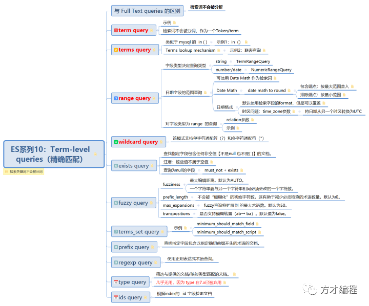
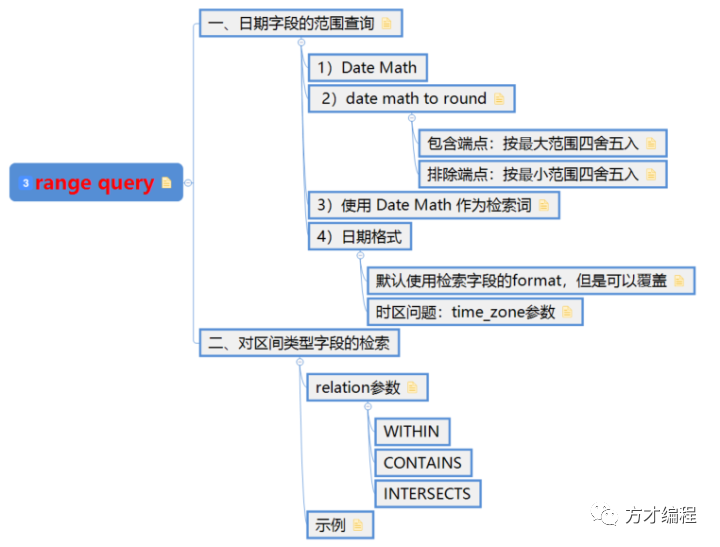

> *带着问题学习才高效*
>
> 1. 对date字段进行范围检索时，你还在使用代码计算时间范围？不知道 Date Math 如何使用？
> 2. Date Math 的四舍五入没弄明白？检索范围总是违背预期
> 3. 对区间类型字段的检索，不明白两个范围值的数学关系？
>
> 
>
> 
>
> Term-level queries系列脑图
>
> **ps：上图的xmind文件****获取方式见文末！**
>
> 
>
> 
>
> 本文结构导航
>
> **在学习本文之前，请先参考**【[ES系列09：Term-level queries 之 Term/Terms query](http://mp.weixin.qq.com/s?__biz=MzIxMjE3NjYwOQ==&mid=2247483903&idx=1&sn=caf90a146527927b01c329e371c39af7&chksm=974b5a71a03cd367fb64a99284bed011b0829bff6b9107362a58035eefdc60a8774ed229d07f&scene=21#wechat_redirect)】**完成 blogs_index 索引的创建，**同时批量导入如下数据：
>
> ```
> POST _bulk
> {"index":{"_index":"blogs_index","_type":"_doc","_id":"1"}}
> {"id":1,"author":"方才兄","title":"昨日博客","influence":{"gte":10,"lte":15},"createAt":"2020-05-24T10:56:23Z"}
> {"index":{"_index":"blogs_index","_type":"_doc","_id":"2"}}
> {"id":2,"author":"方才兄","title":"今日博客","influence":{"gte":10,"lte":20},"createAt":"2020-05-25T10:56:23Z"}
> {"index":{"_index":"blogs_index","_type":"_doc","_id":"3"}}
> {"id":3,"author":"方才兄","title":"一周内的博客","influence":{"gte":15,"lte":18},"createAt":"2020-05-18T10:56:23Z"}
> {"index":{"_index":"blogs_index","_type":"_doc","_id":"4"}}
> {"id":4,"author":"方才兄","title":"一周外的博客","influence":{"gte":15,"lt":18},"createAt":"2020-05-17T10:56:23Z"}
> {"index":{"_index":"blogs_index","_type":"_doc","_id":"5"}}
> {"id":5,"author":"方才兄","title":"上月博客","influence":{"gt":15,"lt":18},"createAt":"2020-04-26T10:56:23Z"}
> ```
>
> 
>
> 
>
> ***\*01\**** 
>
> ***\*range query 简介\****
>
> ***\*
> \****
>
> **range query** 将匹配到**检索字段在一定范围内**的文档。Lucene查询的类型取决于字段类型，对于string字段为TermRangeQuery，对于数字/日期字段，类型为 NumericRangeQuery。**【这涉及到ES底层实现，后续TeHero会专门开专栏进行分享】**
>
> **
> **
>
> 该range查询接受以下参数：
>
> > gte 大于或等于
>
> > gt 大于
>
> > lte 小于或等于
>
> > lt 少于
>
> > boost  设置查询的提升值，默认为 1.0【权重问题，后续详解】
>
> DSL示例：查询 1<= id <= 2 的文档
>
> ```
> GET /tags_index/_search
> {
>     "query": {
>         "range" : {
>             "id" : {
>                 "gte" : 1,
>                "lte" : 2,
>                 "boost" : 2.0
>             }
>         }
>     }
> }
> ```
>
> 
>
> 
>
> **02** 
>
> **在data字段上的range query**
>
> 
>
> **2.1 Date Math 详解**
>
> > **Date Math** **由两部分组成****：1、以固定的日期开头，这个固定的日期也可以是 now 或者是以“||”结尾的时间字符串；2、固定日期后面可接一个或多个数学表达式。**
>
> 
>
> > **支持的时间单位有**：y-Years、M-Months、w-Weeks、d-Days、h-Hours、H-Hours、m-Minutes、s-Seconds
>
> 看几个Date Math 示例加以理解，比如当前时间：now = 2020-05-26 13:00:00
>
> > 1）**now + 1h** ：now的毫秒值 + 1小时，结果为：2020-05-26 14:00:00
>
> > 2）**now-1h/d**：now的毫秒值 - 1小时，再**根据情况四舍五入**到最近的一天的起始：2020-05-26 00:00:00 或者 结束：2020-05-26 23:59:59.999
>
> > 3）**2020-05-26||-1M/M**：2020-05-26 的毫秒值 + 1个月，再**根据情况四舍五入**到最近的一月的起始：2020-04-01 00:00:00 或者 结束：2020-04-30 23:59:59.999
>
> ps：这里说的“**根据情况四舍五入**”就是下面即将介绍的 **date math to round**
>
> 
>
> 
>
> **2.2 date math to round**
>
> > 当使用date math 将**日期四舍五入到最接近的日期、**月份、小时等的时候，**四舍五入的****日期****取决于****范围的结尾是****包含端点还是排除端点。**
>
> 
>
> **1）包含端点：按最大范围四舍五入**
>
> **
> **
>
> **gte 大于或等于**四舍五入的日期：2020-05-25||/M变为 2020-05-01，**即包括整个月份**。
>
> ```
> GET /blogs_index/_search
> {
>     "query": {
>         "range" : {
>             "createAt" : {
>                 "gte" : "2020-05-25||/M"
>             }
>         }
>     }
> }
> ```
>
> > 上述DSL语句，是可以检索到文档1、2、3、4的（检索结果过长，此处就不展示了，可自行验证）。**等价于sql****【where createAt >= "2020-05-01 00:00:00"】**
>
> 
> 
>
> **lte 小于或等于**四舍五入的日期：2020-05-25||/M变为2020-05-31T23:59:59.999，即**包括整个月份。**
>
> ```
> GET /blogs_index/_search
> {
>     "query": {
>         "range" : {
>             "createAt" : {
>                 "lte" : "2020-05-01||/M"
>             }
>         }
>     }
> }
> ```
>
> > 上述DSL语句，可以检索到所有文档（检索结果过长，此处就不展示了，可自行验证）。**等价于sql****【where createAt <= "2020-05-31 23:59:59.999"】**
>
> 
>
> **2）排除端点：按最小范围四舍五入**
>
> **
> **
>
> **gt 大于**四舍五入的日期：2020-05-01||/M 变为 2020-05-31T23:59:59.999，**即排除整个月份。**
>
> ```
> GET /blogs_index/_search
> {
>     "query": {
>         "range" : {
>             "createAt" : {
>                 "gt" : "2020-05-01||/M"
>             }
>         }
>     }
> }
> ```
>
> > 上述DSL语句，检索不到任何文档。**等价于sql****【where createAt > "2020-05-31T23:59:59.999"】**
>
> 
>
> **lt 少于**四舍五入的日期：2020-05-31||/M变为2020-05-01，**即排除整个月份。**
>
> ```
> GET /blogs_index/_search
> {
>     "query": {
>         "range" : {
>             "createAt" : {
>                 "lt" : "2020-05-31||/M"
>             }
>         }
>     }
> }
> ```
>
> > 上述DSL语句，可以检索到文档5。**等价于sql****【where createAt < "2020-05-01 00:00:00"】**
>
> 
>
> 
>
> **2.3 使用** Date Math **进行检索**
>
> **
> **
>
> **ps：以下示例，基于now = 2020-05-25 23:00:00**
>
> 
>
> **1)**  获取**昨天**发布的博客
>
> ```
> GET /blogs_index/_search
> {
>     "query": {
>         "range" : {
>             "createAt" : {
>                 "gte" : "now-1d/d",
>                "lt" :  "now/d"
>             }
>         }
>     }
> }
> ```
>
> > 分析：上述DSL可以检索到文档1【"title": "昨日博客"】，**等价于sql****【where createAt >= "2020-05-24 00:00:00" and createAt  < "2020-05-25 00:00:00"】**
>
> 
>
> **2)**  获取**一周内**发布的博客
>
> ```
> GET /blogs_index/_search
> {
>     "query": {
>         "range" : {
>             "createAt" : {
>                 "gte" : "now-1w/d",
>                "lt" :  "now/d"
>             }
>         }
>     }
> }
> ```
>
> > 分析：上述DSL可以检索到文档1【"title": "昨日博客"】和文档3【"title": "一周内的博客",】，**等价于sql****【where createAt >= "2020-05-18 00:00:00" and createAt  < "2020-05-25 00:00:00"】**
>
> 
>
> **3)**  获取**本月内**发布的博客
>
> ```
> GET /blogs_index/_search
> {
>     "query": {
>         "range" : {
>             "createAt" : {
>                 "gte" : "now/M",
>                "lte" :  "now/M"
>             }
>         }
>     }
> }
> ```
>
> > 分析：上述DSL可以检索到文档1/2/3/4，**等价于sql****【where createAt >= "2020-05-01 00:00:00" and createAt  < "2020-05-31 23:59:59.999"】**
>
> 
>
> 
>
> **2.4 日期格式**
>
> 
>
> 1）对日期字段进行检索时，**默认使用被检索字段的format**，但是可以通过“format”参数覆盖
>
> ```
> GET /blogs_index/_search
> {
>     "query": {
>         "range" : {
>             "createAt" : {
>                 "gte": "20/05/2020",
>                 "lte": "2021",
>                 "format": "dd/MM/yyyy||yyyy"
>             }
>         }
>     }
> }
> 
> 请注意，如果日期缺少年，月和日的某些坐标，则丢失的部分将以unix time的开始（即1970年1月1日）填充 。
> 这意味着，例如，当指定dd格式时，"gte" : 10 将使用翻译成1970-01-10T00:00:00.000Z。
> ```
>
> > 上述DSL语句，可以检索到文档1和文档2。**等价于sql****【where createAt >= "2020-05-24T00:00:00Z" and createAt < "2021-01-01T00:00:00.000Z" 】**
>
> > **注意：****如果没有** "format"**，上述DSL执行将报parse_exception 异常，****因为date类型默认只支持3种格式****，请参见【[ElasticSearch系列03：ES的数据类型](http://mp.weixin.qq.com/s?__biz=MzIxMjE3NjYwOQ==&mid=2247483734&idx=1&sn=dac2e9f092303b57314f8744a82fb9ff&chksm=974b5ad8a03cd3ce7be4ff7b4e942cf57645c773b54c855fcd3777755d95f5fb50dad0aab013&scene=21#wechat_redirect)】**
>
> 
>
> 
>
> **2）时区问题：time_zone参数**
>
> 将日期从另一个时区转换为UTC
>
> ```
> GET /blogs_index/_search
> {
>     "query": {
>         "range" : {
>             "createAt" : {
>                 "gte": "2020-05-25T11:56:23",
>                 "lte": "now",
>                 "time_zone": "+02:00"
>             }
>         }
>     }
> }
> ```
>
> > **"gte": "2020-05-25T11:56:23", 该日期将转换为2020-05-25T09:56:23 UTC。【所以该DSL可以检索到文档2**（它的"createAt" :"2020-05-25T10:56:23Z"**），**如果没有 "time_zone": "+02:00"，就检索不到任何文档。**】** 
> >
> > now不受time_zone参数的影响，它始终是当前系统时间（以UTC为单位）。但是，在使用日期数学舍入时（例如，使用向下舍入到最近的日期now/d），time_zone将考虑提供的值。	
>
> 
>
> 
>
> **03** 
>
> **对类型为 range 字段的查询**
>
> **
> **
>
> **relation**参数**控制**这两个范围值【一个是文档field的value，一个是检索范围】如何匹配
>
> > 先把文档influence字段的value列出来，方便大家对比数据：文档1【"gte":10,"lte":15】、文档2【"gte":10,"lte":20】、文档3【"gte":15,"lte":18】、文档4【"gte":15,"lt":18】、文档5【"gt":15,"lt":18】
>
> 
>
> **3.1 WITHIN：**文档的范围字段**要完全在**检索关键词**的范围里**。
>
> ```
> GET /blogs_index/_search
> {
>   "query" : {
>     "range" : {
>       "influence": {
>         "gte" : 12,
>         "lte" : 17,
>         "relation" : "within"
>       }
>     }
>   }
> }
> ```
>
> > 可以检索**到文档4和文档5**，【15,18）完全在【12,17】范围里
>
> 
>
> **3.2 CONTAINS**：文档的范围字段**完全包含**检索关键词的范围；
>
> ```
> GET /blogs_index/_search
> {
>   "query" : {
>     "range" : {
>       "influence": {
>         "gte" : 12,
>         "lte" : 17,
>         "relation" : "CONTAINS"
>       }
>     }
>   }
> }
> ```
>
> > 可以检索**到文档2**，只有【10,20】完全包含【12,17】范围
>
> 
>
> **3.3 INTERSECTS：**（**为默认值**）文档的范围字段与检索关键词的范围**有交集**即可。
>
> ```
> GET /blogs_index/_search
> {
>   "query" : {
>     "range" : {
>       "influence": {
>         "gte" : 12,
>         "lte" : 17,
>         "relation" : "CONTAINS"
>       }
>     }
>   }
> }
> ```
>
> > 可以检索**到所有文档，都有交集**
>
> 
>
> 
>
> **04** 
>
> **总结**
>
> 
>
> 通过本文，我们应该掌握以下知识点：
>
> > 1、会**计算 Date Math**，理解并**掌握 Date Math 的四舍五入**；
>
> > 2、掌握 range query **使用  Date Math 作检索；**
>
> > 3、对区间类型字段的检索，要理解**并掌握 relation 参数的 3个值的含义**。
>
> > 下期预告：Term-level queries(3)【**关注公众号：****方才编程****，系统学习ES**】