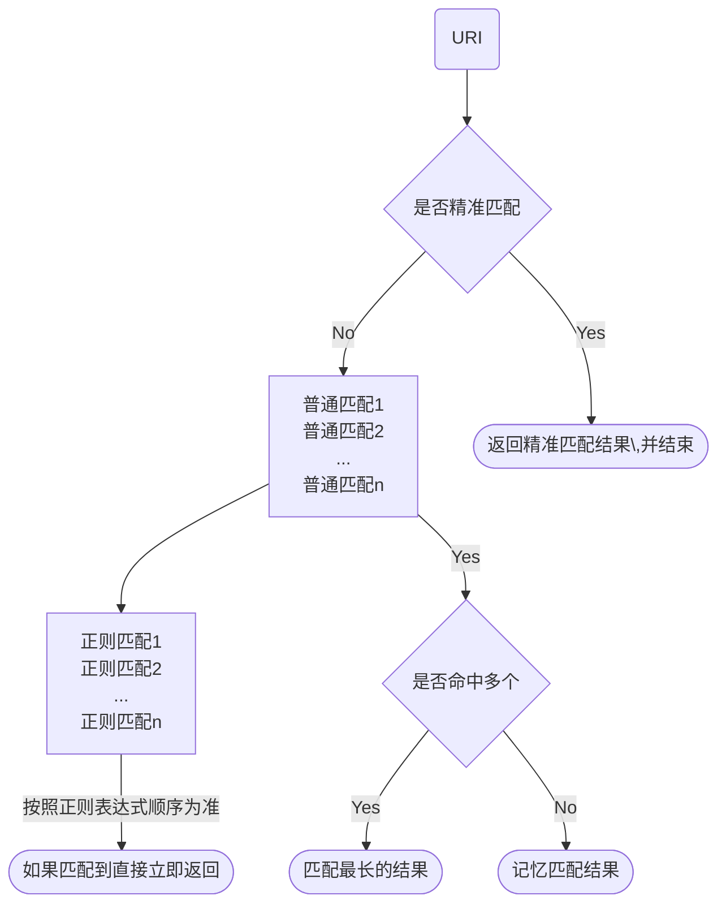

#### 1. Location 的判断顺序




#### 2. nginx reverse proxy 斜杠产生的作用

```shell
location /some/path/ {
	proxy_pass http://www.example.com/link/;
}
```


Note that in the first example above, the address of the proxied server is followed by a URI, `/link/`. If the URI is specified along with the address, ==it replaces the part of the request URI that matches the location parameter==. For example, here the request with the `/some/path/page.html` URI will be proxied to `http://www.example.com/link/page.html`. If the address is specified without a URI, or it is not possible to determine the part of URI to be replaced, the full request URI is passed (possibly, modified).