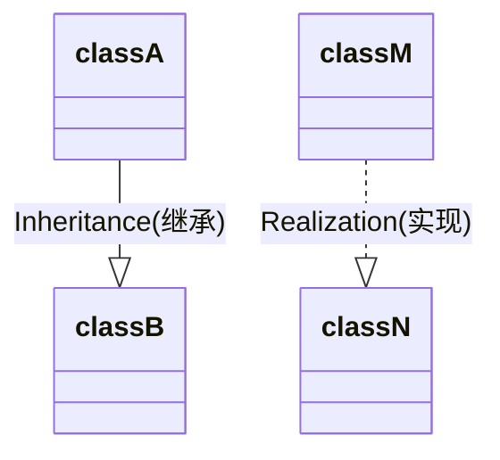
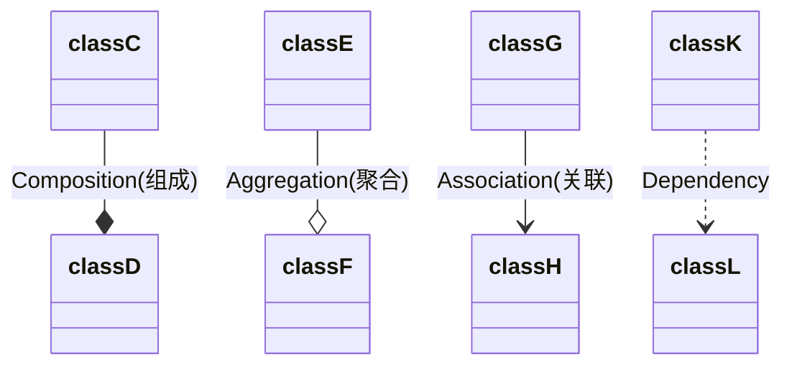
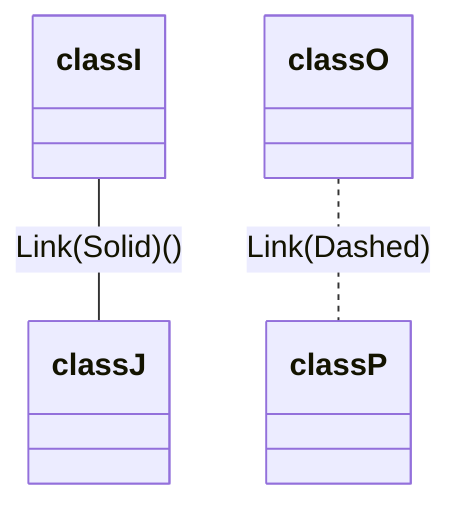
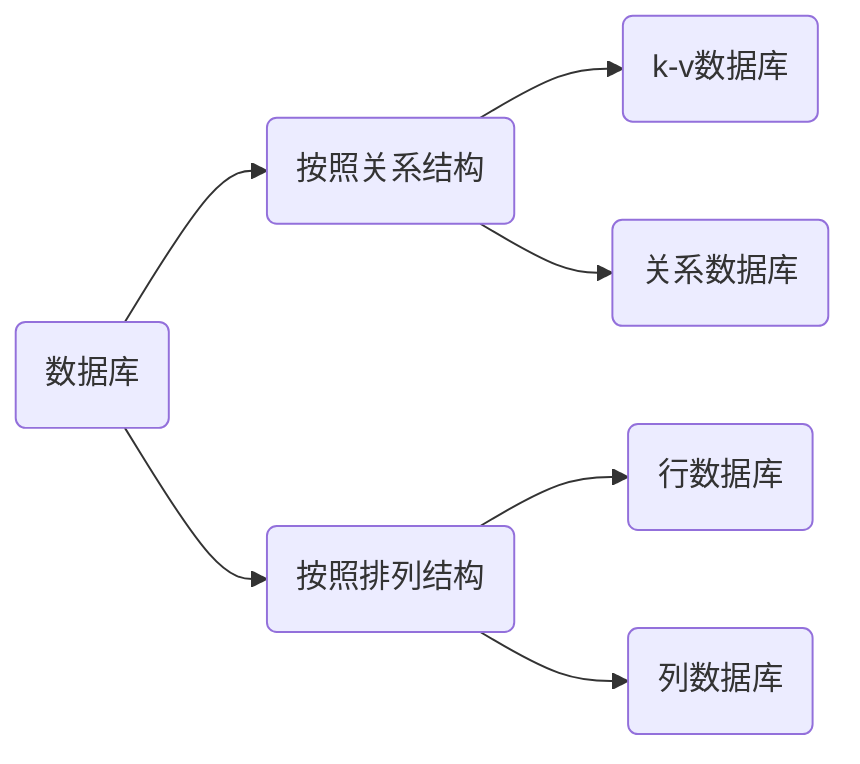

```mermaid
classDiagram
classA --|> classB : Inheritance(继承)
classM ..|> classN : Realization(实现)
```

纵向关系：
继承Inheritance：子类属于父类的一种
实现Realization：子类实现父类接口

```mermaid
classDiagram
classC --* classD : Composition(组成)
classE --o classF : Aggregation(聚合)
classG --> classH : Association(关联)
classK ..> classL : Dependency
```

横向关系：关联程度从强到弱
组合Composition：包含关系，不可分离，大类析构时小类同时也会析构
聚合Aggregation：包含关系，可分离，大类析构时小类还可以继续用
关联Association：引用的关系，平等。
依赖Dependency：引用的关系，不平等。

```mermaid
classDiagram
classI -- classJ : Link(Solid)()
classO .. classP : Link(Dashed)
```

```mermaid
graph LR
a1(数据库)-->b1(按照关系结构)
b1-->c1(k-v数据库) 
b1-->c2(关系数据库)
a1 --> b2(按照排列结构)
b2 --> b3(行数据库)
b2 --> b4(列数据库)
```
