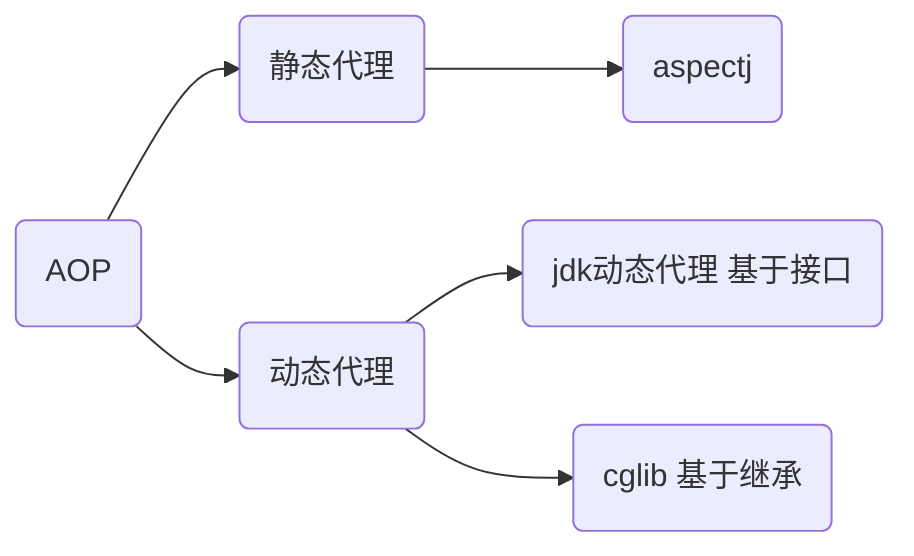

分为两种

如图:

```mermaid
graph LR
A(AOP) -->| |B(静态代理)
B --> | |F(aspectj)
A --> | |C(动态代理)
C --> | |D(jdk动态代理 基于接口)
C --> | |E(cglib 基于继承)
```

静态代理：AspectJ

动态代理: jdk、

AspectJ是eclipse基金会的一个项目

aspectj提供了两套相对切面的描述方法，

1.最常见的就是基于java注解的，

2.此外还有一种基于aspect问的的切面描述，此语法并非java语法，需要专门的插件才能进行语法检查与操作

