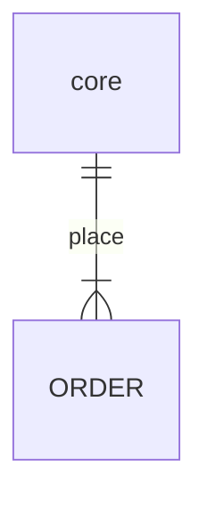

背景

1、某市一个业务项目，在业务流程中有一个环节出现了，需要对多种模型进行判断处理，但是判断条件采用了多条件的组合，

这些条件可以理解为判断表达式，判断行为有多种情况。之间的组合存在并行、嵌套。如果依据每一个模型进行代码编写，会出现大量的

duplication code, 如果对duplication code 进行统一抽离，因为利用率的不等，又会分离出更多的方法，耦合维护成本过高

2、利用设计模式的高聚合、底

3、组件设置

module模型

