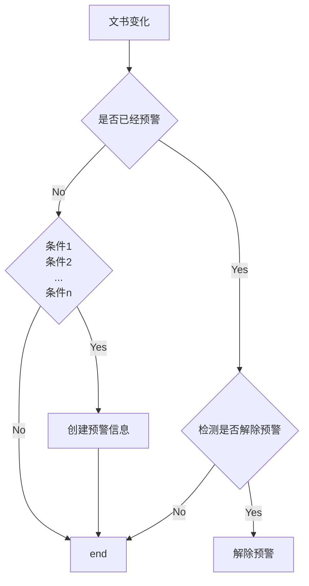

``` shell
docker run --name kafka01 \
-p 9092:9092 \
-e KAFKA_BROKER_ID=0 \
-e KAFKA_ZOOKEEPER_CONNECT=47.106.190.68:2181 \
-e KAFKA_ADVERTISED_LISTENERS=PLAINTEXT://47.106.190.68:9092 \
-e KAFKA_LISTENERS=PLAINTEXT://0.0.0.0:9092 \
-d wurstmeister/kafka

docker run -d --name kafka --publish 9092:9092 --link zookeeper --env KAFKA_ZOOKEEPER_CONNECT=zookeeper:2181 --env =127.0.0.1 --env HOST_NAMEK192.168.0.157 TISED_PORT=9092 wurstmeister/kafk--volume /etc/localtime:/etc/localtime a:latest

docker run -d --name kafka --publish 9092:9092 --link zookeeper --env KAFKA_ZOOKEEPER_CONNECT=zookeeper:2181 --env KAFKA_ADVERTISED_LISTENERS=PLAINTEXT://127.0.0.1:9092 wurstmeister/kafka:latest
```