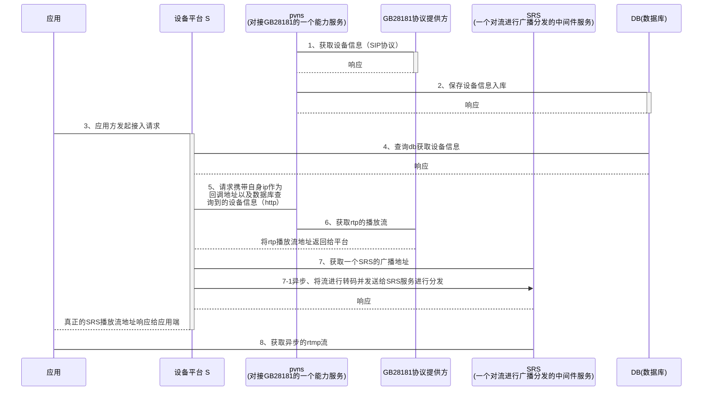
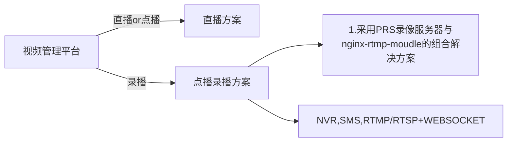

### 共同点

1、两者从功能上说，都是解决视频流设备到业务系统应用的接入的中间层解决方案

2、两者在协议上都是直接采用了 RTP -> RTSP  -> RTMP 这个转换的解决方案

### 区别:

1、功能上的最主要区别是视频管理平台将设备的录像服务器纳入到自己的组件中。

2、在功能的系统拆分上，视屏管理平台更模块化，国标将大部分组件集成到dms平台服务上一并融合、设备这块的拉取采用的是psvn拉取设备数据直接到库，dms再去数据库直接进行crud。

3、对于客户端的调用方来看，设备信息的获取这里国标采用的是传统的http，视频管理平台采用的是ws  加 + http头的方式通信。但是在所提供的能力上是大体一致的，除了个别细节

4、视屏管理平台也提供了RTSP的直接支持，但是目前只有对ws的集成。


### 建议：

从平台的扩展性，文档的完善性以及组件的可插拔。其实这两套平台都可以采纳，单建议一阶段可以直接采用一边的解决方案、采用规范约束的接口来做兼容集成。先完善一边的底层实现。


### 改造集成：

一、对这种视屏流的调用场景接口化、先完成对视屏管理平台的实现、对国标平台在向后做局部兼容集成。

二、基于国标和视屏管理平台的用例，快速开发平台可以实现一套对RTMP流的播放的html模版、集成到快速开发平台

三、基于上面所完成的sdk、以及html模版。完成一套基本的三方业务的最建议demo的用例，集成到快速开发平台


```sequence


```




|          |                             国标                             |                         视屏管理平台                         |                                                              |
| -------- | :----------------------------------------------------------: | :----------------------------------------------------------: | ------------------------------------------------------------ |
| 开发语言 |                        java、html、js                        |                        C++、html、js                         |                                                              |
| 输出协议 |                    两种数据均使用RTMP输出                    |          监控流：RTMP、RTSP<br /> 录像流：RTSP、HLS          | RTSP适合实时交互、目前RTSP、HLS对web的录像功能的支持不是很好，只支持播放暂停、加速拖拽暂时无法实现。<br />RTMP对录像的支持较好 |
| 信令协议 |                             http                             |                          websocket                           | websocket支持设备的订阅，以及服务端的实时消息推送（设备状态，故障信号）。对于故障的监控处理上更便利，但是长链接对资源的消耗较高<br />http逻辑简单、开发成本低、但是对于实时状态的维护成本高，可靠性低 |
| 模块化   | 拆分为两个模块、模块业务边界清晰、平台模块内的耦合度相对较高 | 基于现有的方案、模块较多、但是模块的边界不清晰、缺少最新文档、很难做模块化的功能划分。 |                                                              |
| 部署     |          依赖skynet平台，需要基于skynet进行组件部署          |                    独立部署，部署较为简便                    |                                                              |
| 文档提供 |    文档内容相对简洁、代码没有设计框架文档、暂时没有人维护    |    文档较为陈旧、新版设计文档开发文档编写中，预计2周完成     |                                                              |
| 分流技术 |                          SRS(rtmp)                           | Live555集成的实现路由分发(rtsp)<br />nginx + http + flv(rtmp、http-flv) | 同样是输入流RTMP，前者性能是好与nginx-module这种组合方案。格式的支持是一致的，都支持3种格式的输出。 |
|          |                                                              |                                                              |                                                              |
|          |                                                              |                                                              |                                                              |


视频管理平台 是否具备将部分模块拆分出来作为 点播模块的方案

如果不建议采纳内部方案，有什么第三方开源方案推荐

直播或者说监控方案、是否只能针对传统的监控摄像头的推流设备做集成、普通的pc、移动设备的普通摄像头是否可以做到动态订阅与推流广播


SMS


SIP:Session Initiation Protocol会话初始协议，属于应用层控制协议， 一般用来创建一次音频、视频通话（双向）

RTSP:Real Time Streaming Protocol，实时流协议,属于应用层控制协议 ， 多个媒体流的时间同步方面比sip强大， 一般用来做视频点播、视频监控等（单向）

RTP: Real-time Transport Protocol 实时传输协议,是一个[网络传输协议]
RTCP: RTP Control Protocol 传输协议

PS: 数据流类型。对视频流和音频流封装的

TS: TransportStream

H264：视频流编码标准


ONVIF：国际标准 //todo

GB28181: 国标 //todo


RTP over UDP  or RTP over TCP


视频管理平台的使用场景




