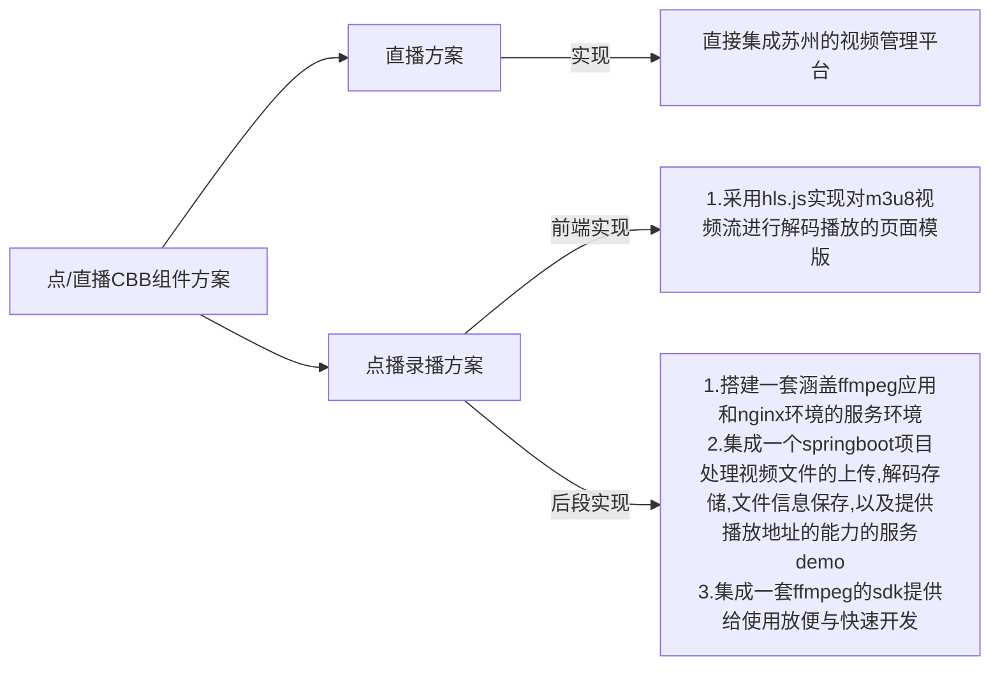
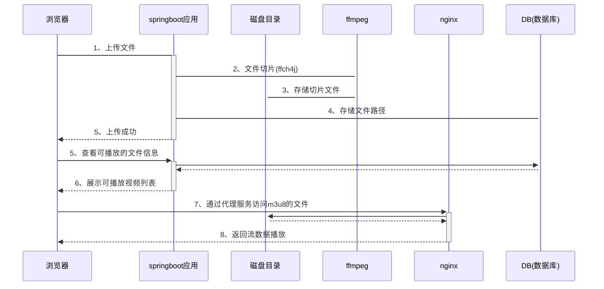

直播相关任务

由汪坤项目组全部开发

9月18日前提供一套含有web播放的完整的播放方案，以及接口文档

9月18日前完成模拟环境的部署工作








点播相关计划

|      | 开发任务                                                     | 开发时间      |
| ---- | ------------------------------------------------------------ | ------------- |
|      | 完成ffmpeg + nginx 环境的搭建配置                            | （1个工作日） |
|      | 基于此环境进行一个简单的springboot后端服务模版，提供上传、视频切片、保存视频信息以及提供查看播放的服务功能 | (4个工作日)   |
|      | 实现视频的上传、查看、播放页面，基于hls.js 实现一套播放器模版 | (1个工作日)   |
|      | 在测试环境部署完成点播和直播两个场景的demo，以及相关的使用说明文档 | (2个工作日)   |


补充关键帧

磁盘存储方案

ffmpeg支持的格式

ffmpeg 命令

```shell
ffmpeg -i Hanzawa.Naoki.S02E07.Chi_Jap.HDTVrip.1280X720.mp4 -hls_time 300 -hls_list_size 0  -f hls hanzawa.m3u8
```

