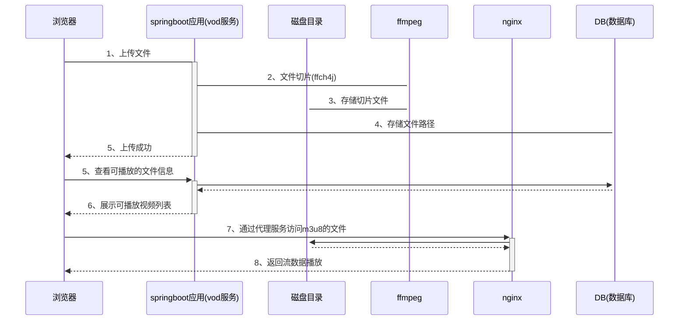

# 点播方案详细设计

### 一.依赖组件

Nginx1.17， FFMPEG4.3.1，vod服务(springboot服务，前端集成的video.js)

### 二.服务逻辑设计


a.设计主体方案

1、采用ffmpeg 对上传文件进行切片处理，生成可以进行点播的hls协议规范的 m3u8索引文件以及实际的播放内容ts文件。

2、对文件服务和web服务采用nginx映射，将映射的播放地址采用h2数据库进行保存。

3、再通过web服务查询保存后的切片记录，通过浏览器经过video.js 的播放器进行播放展示。


b.采用的几个技术点的相关理由

首先、主流的点播服务主要分为dash协议和hls协议播放，都支持分辨率自适应，这也是切片的主要意义，可以在播放过程中进行不同分辨率块的动态切换。

前端基于h5 + video.js对hls才能进行解码播放。

nginx作为web服务器，适合做静态资源的代理访问，正符合点播这种大量读取静态资源的需求


c.暂时还未实现，下一版本需要实现的功能

1.支持对m3u8内容的手动调整，达到可以使用分布式文件存储系统存储ts文件

2.支持多码率的切片，达到播放器可以根据网络状态切换不同的分辨率

3.优化切片的线程策略，确保服务器的压力保障



### 四.组件安装

1.ffmpeg的安装

解压ffmpeg_build265.tar.gz包至/usr/local目录下：

路径为/usr/local/ffmpeg_build265

 

\# vi /etc/profile

在最后PATH添加环境变量：

export FFMPEG_PATH=/usr/local/ffmpeg_build265

export PATH=$PATH:$FFMPEG_PATH/bin

export LD_LIBRARY_PATH=$FFMPEG_PATH/lib

s保存退出

 

\# source /etc/profile  设置生效

\# ffmpeg -version    查看版本

 


2.nginx安装，一般现场挂源环境直接yum install

nginx启动命令

```shell
nginx -c /etc/nginx/nginx.conf
```

配置项nginx.conf 需要配置的地方

```
    upstream vod{
    #vod服务地址
		server 127.0.0.1:7777 weight=10;
    }

    server {
        listen       8080;
        server_name  localhost;
        #上传文件解除限制
				client_max_body_size 2000M;

        location / {
            root   html;
            index  index.html index.htm;
        }

        location /hls {
					types{
						application/vnd.apple.mpegurl m3u8;
						video/mp2t ts;
					}
					#视频存储路径 下方地址 + /hls是m3u8文件的存放路径
					root /Users/qishen/Documents;
					add_header Cache-Control no-cache;
				}

				#vod路径映射
        location /vod {
		    proxy_pass http://vod/;
        }


        error_page   500 502 503 504  /50x.html;
        location = /50x.html {
            root   html;
        }
    }
```


